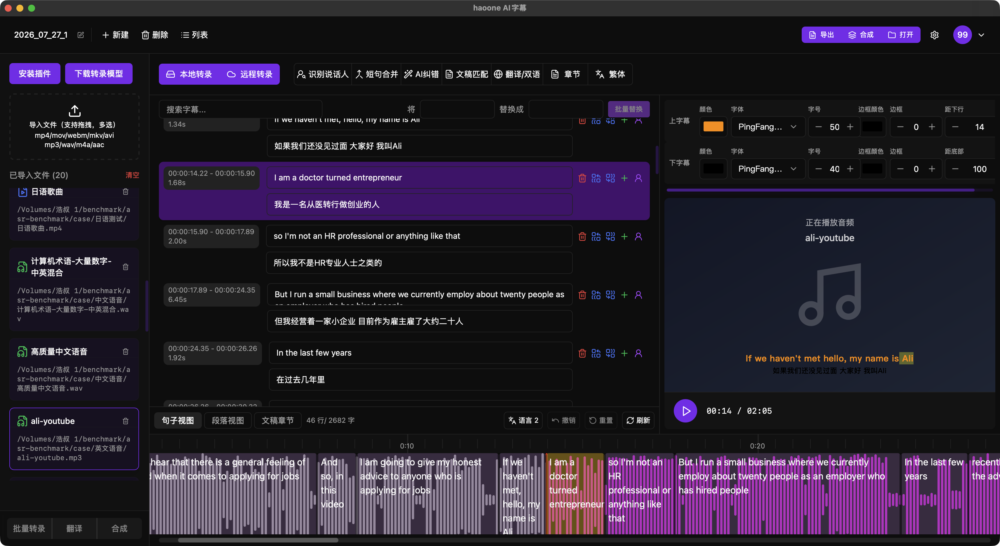
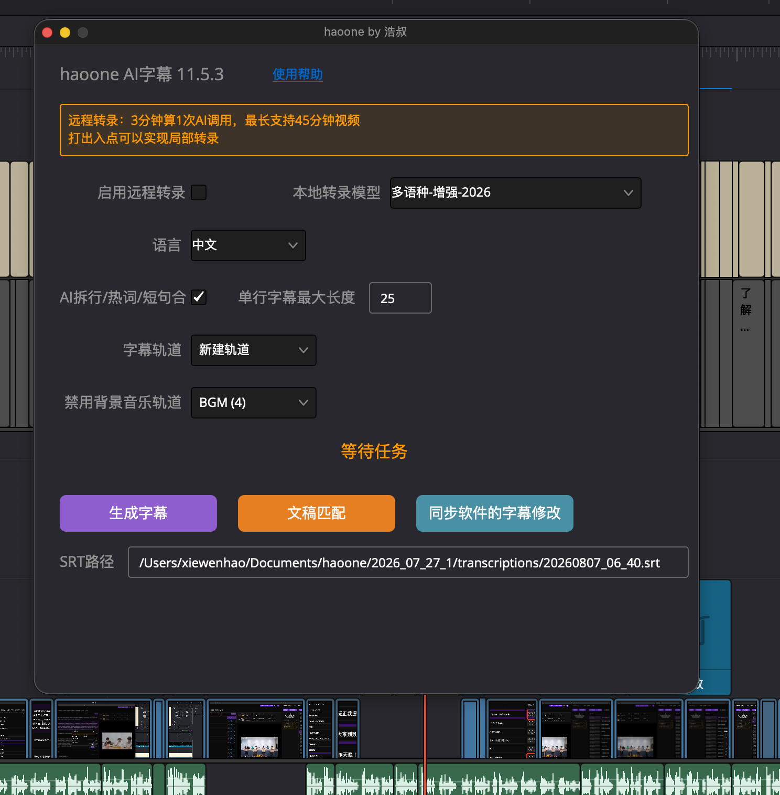
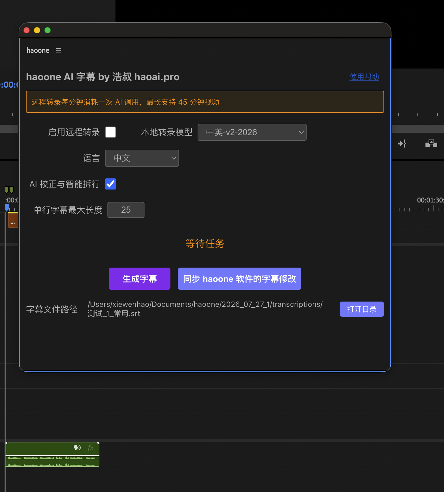
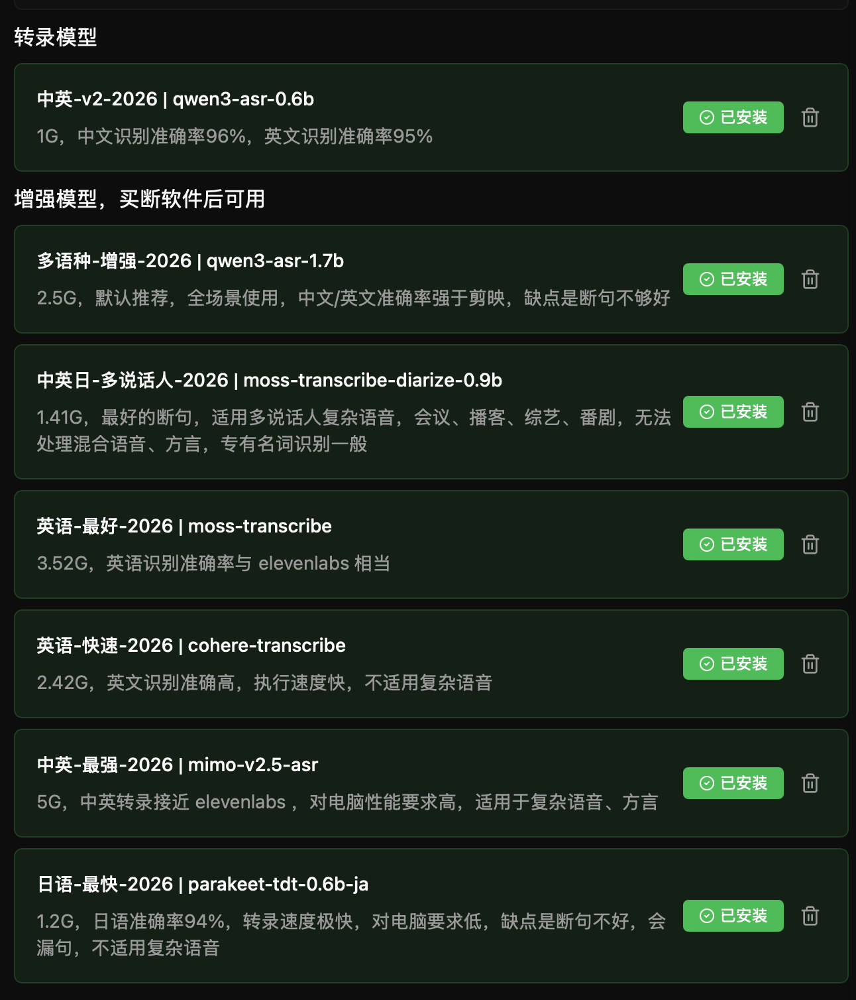

# haoone-app

  
  <h1>haoone V11</h1>
  
新一代 AI 专业字幕软件，中英转录识别准确率97%，词语音频对齐率98%

  [官网](https://www.haoai.pro/haoone) / [免费下载软件](https://www.haoai.pro/haoone/download)  /  [命令行工具](https://github.com/minghe36/haoone-cli)  /  [skill](https://github.com/minghe36/haoone-skill)  / [english](https://github.com/minghe36/haoone-app/blob/master/README-en.md)

达芬奇字幕插件：

PR 字幕插件：

## haoone 软件介绍

覆盖字幕识别生成与字幕翻译工作流的所有核心需求。

剪映字幕、elevenlabs 语音转文本的最佳本地版平替之一。

可能是市面上功能最全面的字幕软件，集成了市面上最先进的开源 ASR 模型，做到开箱即用，windows 与 mac 都可以使用。

haoone 软件基础功能永久免费使用，增强功能一次性买断，无订阅费用。

### 项目持续迭代中，欢迎给项目点个 star 支持，万分感谢。

弃用 whisper 方案，如果你正在使用基于 whisper 的软件， whisper 无法满足你的需求，可以试试 haoone 软件。

转录引擎基于 rust+c++，转录速度快，自动开启 GPU 加速。自研词语级音频对齐。

本地转录、远程转录、文稿匹配、智能拆行、AI校正、AI 智能热词、翻译、双语字幕、专业字幕编辑器、字幕合成、自定义大模型 API...

让工具适配你的工作流：达芬奇字幕插件、PR字幕插件、命令行工具、skill 封装

多文件一键批量化操作

长音视频优化：2 小时的文件都能转录（mac 耗时仅需 10 分钟），支持说话人识别

快：本地转录3分钟视频，mac mini m4 16G 20 秒内完成

准：中英转录识别准确率96%以上，带智能热词，越用越准

齐：自研词语级对齐算法，词语音频对齐率98%

可能是市面上最好的日语转录软件：日语专用模型日语识别准确率 94%，词语级音频对齐率 99%，30 分钟视频 3 分钟内即可完成转录，可配热词，支持中日双语字幕

电脑性能不好的也可以使用。可能是市面上第一个支持 mimo-v2.5-asr API 的字幕软件，mimo-v2.5-asr 1 小时转录仅需 0.5元，中英准确率可以对标 elevenlabs 的语音转文本，吊打剪映、豆包 API、qwen3-asr-flash API

[下载软件](https://www.haoai.pro/haoone/download)

## 视频使用教程

* [haoone AI 字幕软件 V10 保姆级教程，正在实现本地版 elevenlabs的语音转文本软件](https://www.bilibili.com/video/BV1wRMg6REcz/?vd_source=50c41c1bed77ff65f5947e5b52ba3e85)
* [haoone 字幕软件V11保姆级教程：这个达芬奇字幕插件有点强](https://www.bilibili.com/video/BV1FZMy6DEqb)
* [说话人识别详细使用教程—haoone 字幕软件 V11 上新，对齐 elevenlabs 的说话人识别功能](https://www.bilibili.com/video/BV1LQKH6zEF2/?vd_source=50c41c1bed77ff65f5947e5b52ba3e85)
* [接入 mimo-V2.5-asr API，平替 elevenlabs 的语音转文字？最便宜且很强](https://www.bilibili.com/video/BV12bE16REdo/?vd_source=50c41c1bed77ff65f5947e5b52ba3e85)
* [达芬奇中如何以最快方式实现不同样式的双语字幕？](https://www.bilibili.com/video/BV1HnVm63EUu/?vd_source=50c41c1bed77ff65f5947e5b52ba3e85)
* [AI专业日语字幕软件上新，日语识别准确度 94%，词语级音频对齐率 99%，30 分钟视频 3 分钟内完成转录](https://www.bilibili.com/video/BV1gSVS6FEj5/?vd_source=50c41c1bed77ff65f5947e5b52ba3e85)
* [让语音转文字准确度越用越接近 99%，我是如何做 ASR 的热词替换的？](https://www.bilibili.com/video/BV1Y4oKBEEru/?vd_source=50c41c1bed77ff65f5947e5b52ba3e85)
* [批量转录与合成双语字幕 如此简单](https://www.bilibili.com/video/BV1gtD9BhEmq/?vd_source=50c41c1bed77ff65f5947e5b52ba3e85)
* [PR最佳字幕转录插件？haoone 上线 PR 字幕插件](https://www.bilibili.com/video/BV1kG9cBrEaz/?vd_source=50c41c1bed77ff65f5947e5b52ba3e85)
* [AI专业字幕软件haoone V8正式发布-实现达芬奇中文字幕转录与高效编辑](https://www.bilibili.com/video/BV1t9zNBFEmD/?vd_source=50c41c1bed77ff65f5947e5b52ba3e85)
* [【免费使用】AI专业字幕软件haoone的本地中英转录，准确率 96%以上，词语对齐率 98%](https://www.bilibili.com/video/BV1n7XKBSELn/?vd_source=50c41c1bed77ff65f5947e5b52ba3e85)
* [发布增强版达芬奇文稿匹配插件 haoone 不限匹配字数](https://www.bilibili.com/video/BV1WDAszKEjE/?vd_source=50c41c1bed77ff65f5947e5b52ba3e85)
* [AI专业字幕软件haoone V8正式发布-实现达芬奇中文字幕转录与高效编辑](https://www.bilibili.com/video/BV1t9zNBFEmD/?vd_source=50c41c1bed77ff65f5947e5b52ba3e85)

## 本地模型支持

所有模型都是经过浩叔严格评测验证，不是集成所有模型，而是集成最好或有特定用途场景的模型，会不断更新。

### 模型评测视频

* [锐评2026年 ASR 开源模型，中文识别准确率与稳定性最好的模型是...](https://www.bilibili.com/video/BV1ggdgBQEHF/?vd_source=50c41c1bed77ff65f5947e5b52ba3e85)
* [日语识别最准确的ASR模型是？？？锐评2026年日语 ASR 开源模型](https://www.bilibili.com/video/BV1ReLq6BEUN/?vd_source=50c41c1bed77ff65f5947e5b52ba3e85)
* [锐评2026年英语 ASR 开源模型，哪个模型英语识别最准？](https://www.bilibili.com/video/BV1qAEn6iEgm/?vd_source=50c41c1bed77ff65f5947e5b52ba3e85)

## 关于软件作者

我是浩叔，前阿里高级技术专家，构建 AI 时代的十倍效率剪辑工具，构建十倍效率的跨端软件开发解决方案，专攻 ASR 模型与 TTS 模型领域，你可以在 B 站上找到我：[浩叔_AI编程](https://space.bilibili.com/1055596703)

在我的B 站频道你将看到关于 ASR 模型与 TTS 模型的评测内容，跨端软件的研发经验。

## 做 haoone 软件的思考

### 市面上已经有那么多字幕软件了，为什么还做 haoone？

市面上绝大多数软件是基于 whisper 套壳软件，我在在使用的过程中，发现在中文转录上有非常多的问题，时间戳也没办法高精度对齐，所以花了大量时间测评市面上所有的 ASR 模型，详见我的测评报告：[锐评2026年 ASR 开源模型，中文识别准确率与稳定性最好的模型是...](https://www.bilibili.com/video/BV1ggdgBQEHF/?vd_source=50c41c1bed77ff65f5947e5b52ba3e85)，2026 年了很多的模型准确度、幻觉的控制、中英混说的处理、专有名词的识别，歌曲的识别、方言的识别早已经超过 whisper 了。所以我做了 haoone，一款使用最先进的 ASR 模型的字幕软件，花大量时间构建了转录引擎与时间戳对齐算法。期望 haoone 能够帮助大家节约字幕生成与字幕校对的时间。

haoone 已经迭代了 11 个大版本，功能已经完善与稳定，haoone 承诺用户数据隐私安全，绝不收集用户的转录数据、音视频文件，请放心使用。

## 开源计划

[haoone-skill 已开源](https://github.com/minghe36/haoone-skill) ：可在各类 Agent 中使用，转录视频、播客字幕，生成带有高精度时间戳的字幕，得到高准确度的文字稿

[haoone PR字幕插件 已开源](https://github.com/minghe36/haoone-pr)：在 PR 中无需打开 haoone 软件，即可完成PR 时间线的字幕转录

haoone 达芬奇字幕插件待开源：在 达芬奇 中无需打开 haoone 软件，即可完成PR 时间线的字幕转录

## 软件截图

软件主界面，专业易用的字幕编辑器，支持项目与多文件管理：

本地转录：基于qwen3-asr，多语种支持，高精度词语级对齐，带有 AI 拆行、AI 智能热词替换、AI 英文专有名词修正

在线转录：准确度超过剪映、豆包 API ，价格显著低于 豆包 API

不限字数的文稿匹配，带有格式化文稿功能，可选择拆行是否遵循文稿，剪映文稿匹配加强版

快速编辑视图，快速找到转录错误，快速修改，支持搜索、批量替换，替换后的词自动进入热词

文稿视图，章节总结视图

支持双语字幕，长文本优化

最强大的 AI 热词替换功能实现

一键安装达芬奇字幕插件，PR 字幕插件

达芬奇字幕插件：[视频介绍](https://www.bilibili.com/video/BV1eq6uBnEXj/?vd_source=50c41c1bed77ff65f5947e5b52ba3e85)

PR字幕插件：[视频介绍](https://www.bilibili.com/video/BV1kG9cBrEaz/?vd_source=50c41c1bed77ff65f5947e5b52ba3e85)

## 功能列表

haoone 是专业的字幕软件，功能非常强大，核心功能：

* 本地转录：基于 qwen3-asr 深度优化，支持多语种，自研的词语级对齐算法
* 远程转录：快准齐的远程转录服务
* 模型下载：一键下载，也支持网盘下载
* AI 智能拆行
* AI 热词替换
* AI 校正
* 达芬奇字幕插件
* PR字幕插件
* haoone-cli 命令行工具
* 字幕 skill
* 文稿匹配：不限字数、支持自动格式化文稿，拆行双模式
* 字幕合成
* 双语字幕
* 专业字幕编辑器
* 多视图：快速编辑视图、章节视图
* 双语字幕
* 翻译
* 一键批量操作
* 搜索与批量替换
* ...

## 功能介绍

- [haoone9与剪映对比转录正确率](https://guide.haoai.pro/guide/haoone/haoone9%E4%B8%8E%E5%89%AA%E6%98%A0%E5%AF%B9%E6%AF%94%E8%BD%AC%E5%BD%95%E6%AD%A3%E7%A1%AE%E7%8E%87)
- [付费权益说明](https://guide.haoai.pro/guide/haoone/%E4%BB%98%E8%B4%B9%E6%9D%83%E7%9B%8A%E8%AF%B4%E6%98%8E)
- [1 安装与更新软件](https://guide.haoai.pro/guide/haoone/1%20%E5%AE%89%E8%A3%85%E4%B8%8E%E6%9B%B4%E6%96%B0%E8%BD%AF%E4%BB%B6)
- [2 激活软件与解除设备绑定](https://guide.haoai.pro/guide/haoone/2%20%E6%BF%80%E6%B4%BB%E8%BD%AF%E4%BB%B6%E4%B8%8E%E8%A7%A3%E9%99%A4%E8%AE%BE%E5%A4%87%E7%BB%91%E5%AE%9A)
- [3.1 安装达芬奇插件](https://guide.haoai.pro/guide/haoone/3.1%20%E5%AE%89%E8%A3%85%E8%BE%BE%E8%8A%AC%E5%A5%87%E6%8F%92%E4%BB%B6)
- [3.2 安装与使用 PR 插件](https://guide.haoai.pro/guide/haoone/3.2%20%E5%AE%89%E8%A3%85%E4%B8%8E%E4%BD%BF%E7%94%A8%20PR%20%E6%8F%92%E4%BB%B6)
- [使用haoone-cli命令行工具](https://guide.haoai.pro/guide/haoone/%E4%BD%BF%E7%94%A8haoone-cli%E5%91%BD%E4%BB%A4%E8%A1%8C%E5%B7%A5%E5%85%B7)
- [4 模型下载与管理](https://guide.haoai.pro/guide/haoone/4%20%E6%A8%A1%E5%9E%8B%E4%B8%8B%E8%BD%BD%E4%B8%8E%E7%AE%A1%E7%90%86)
- [5 导入与切换媒体文件](https://guide.haoai.pro/guide/haoone/5%20%E5%AF%BC%E5%85%A5%E4%B8%8E%E5%88%87%E6%8D%A2%E5%AA%92%E4%BD%93%E6%96%87%E4%BB%B6)
- [6 项目管理](https://guide.haoai.pro/guide/haoone/6%20%E9%A1%B9%E7%9B%AE%E7%AE%A1%E7%90%86)
- [7 本地转录](https://guide.haoai.pro/guide/haoone/7%20%E6%9C%AC%E5%9C%B0%E8%BD%AC%E5%BD%95)
- [8 远程转录](https://guide.haoai.pro/guide/haoone/8%20%E8%BF%9C%E7%A8%8B%E8%BD%AC%E5%BD%95)
- [9 快速修改字幕](https://guide.haoai.pro/guide/haoone/9%20%E5%BF%AB%E9%80%9F%E4%BF%AE%E6%94%B9%E5%AD%97%E5%B9%95)
- [10 时间线](https://guide.haoai.pro/guide/haoone/10%20%E6%97%B6%E9%97%B4%E7%BA%BF)
- [11 文稿匹配](https://guide.haoai.pro/guide/haoone/11%20%E6%96%87%E7%A8%BF%E5%8C%B9%E9%85%8D)
- [12 字幕翻译与双语字幕](https://guide.haoai.pro/guide/haoone/12%20%E5%AD%97%E5%B9%95%E7%BF%BB%E8%AF%91%E4%B8%8E%E5%8F%8C%E8%AF%AD%E5%AD%97%E5%B9%95)
- [13 字幕搜索与批量替换](https://guide.haoai.pro/guide/haoone/13%20%E5%AD%97%E5%B9%95%E6%90%9C%E7%B4%A2%E4%B8%8E%E6%89%B9%E9%87%8F%E6%9B%BF%E6%8D%A2)
- [14 导出字幕文件](https://guide.haoai.pro/guide/haoone/14%20%E5%AF%BC%E5%87%BA%E5%AD%97%E5%B9%95%E6%96%87%E4%BB%B6)
- [15 配置大模型 API](https://guide.haoai.pro/guide/haoone/15%20%E9%85%8D%E7%BD%AE%E5%A4%A7%E6%A8%A1%E5%9E%8B%20API)
- [16 合成字幕与批量合成](https://guide.haoai.pro/guide/haoone/16%20%E5%90%88%E6%88%90%E5%AD%97%E5%B9%95%E4%B8%8E%E6%89%B9%E9%87%8F%E5%90%88%E6%88%90)
- [17 批量转录](https://guide.haoai.pro/guide/haoone/17%20%E6%89%B9%E9%87%8F%E8%BD%AC%E5%BD%95)
- [18 AI 热词替换](https://guide.haoai.pro/guide/haoone/18%20AI%20%E7%83%AD%E8%AF%8D%E6%9B%BF%E6%8D%A2)
- [haoone8与剪映对比转录正确率](https://guide.haoai.pro/guide/haoone/haoone8%E4%B8%8E%E5%89%AA%E6%98%A0%E5%AF%B9%E6%AF%94%E8%BD%AC%E5%BD%95%E6%AD%A3%E7%A1%AE%E7%8E%87)

## 感谢以下开源产品

haoone 基于下面的开源产品，特此鸣谢：

* qwen3-asr
* cohere-transcribe
* tauri 2
* llama.cpp
* ffmpeg

