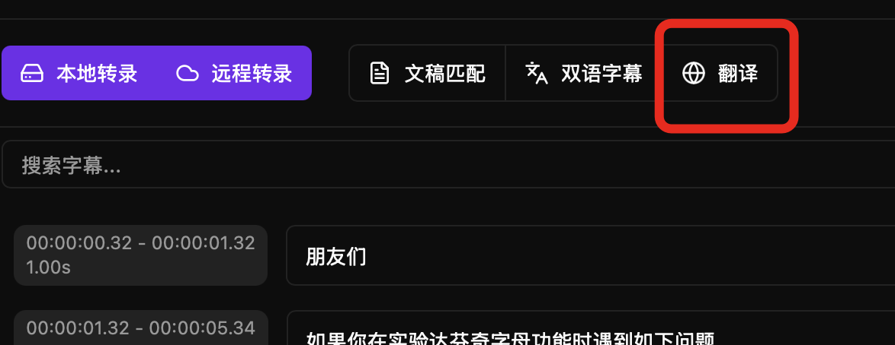
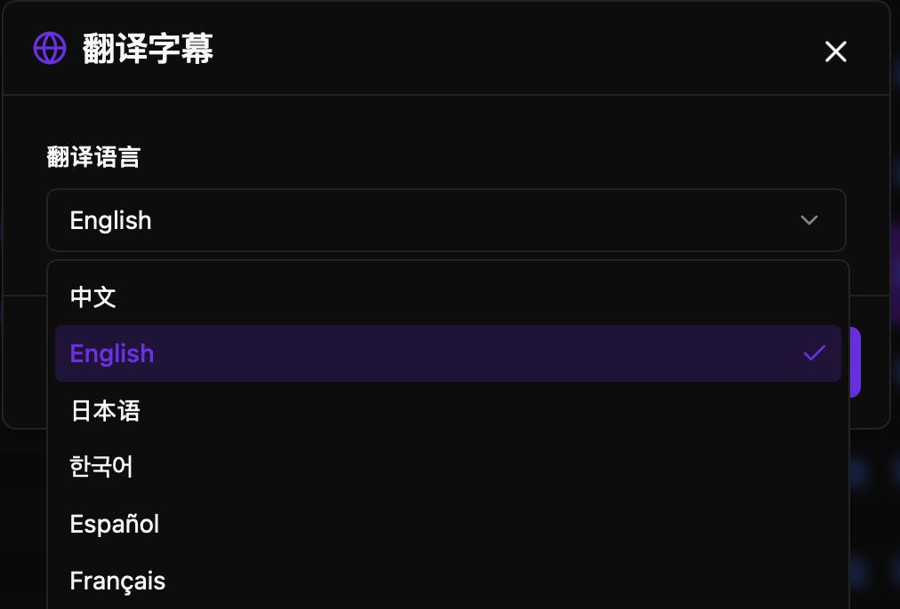
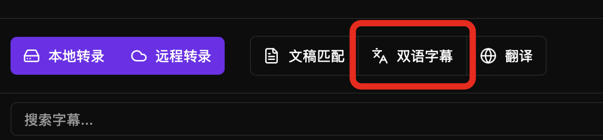
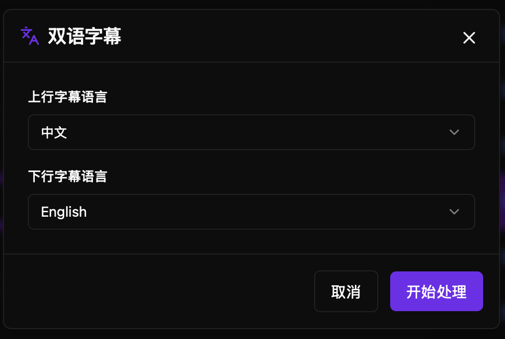

Subtitle Translation and Bilingual Subtitles currently do not process word data, so it is recommended to perform subtitle translation or bilingual subtitles last, after subtitle correction is complete.

<video src="https://cdn.haoai.pro/assets/hao-one/5.mp4" controls />


## Subtitle Translation

You can translate subtitles to your desired language using the software.

Each use consumes 1 AI call quota.





## Bilingual Subtitles


You can generate Chinese-English bilingual subtitles using the software, and control which language is displayed on the top or bottom line.

Each use consumes 1 AI call quota.





## Custom Translation Prompts

You can customize translation and bilingual prompts in the settings page. Different languages can have different prompts.


## Workflow with DaVinci Resolve Plugin

```
  DaVinci Open Timeline
         ↓
  Run haoone Plugin
         ↓
  Transcribe to Generate Subtitles
         ↓
  Open haoone Software
         ↓
  Switch to Corresponding Transcription File (Last Media File)
         ↓
  Subtitle Translation and Bilingual Subtitles
         ↓
  In Plugin, Click "Sync Subtitle Changes from Software"
```


