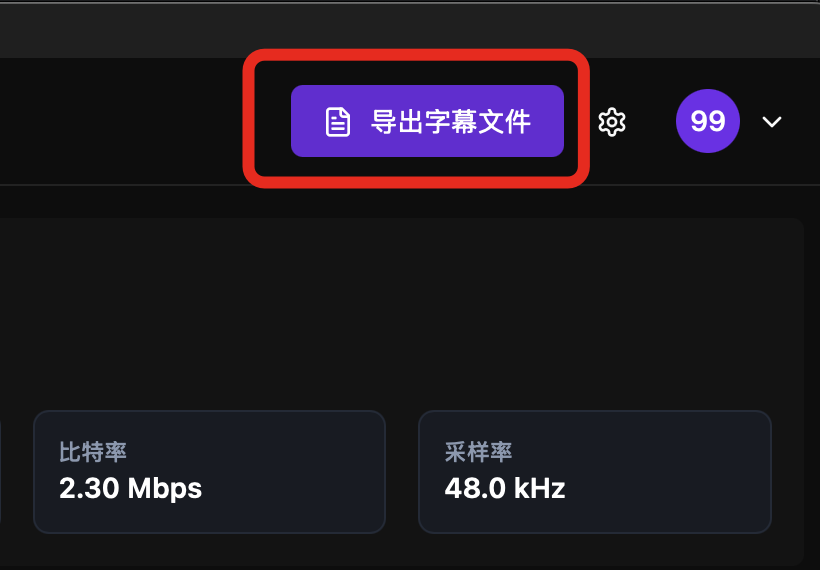
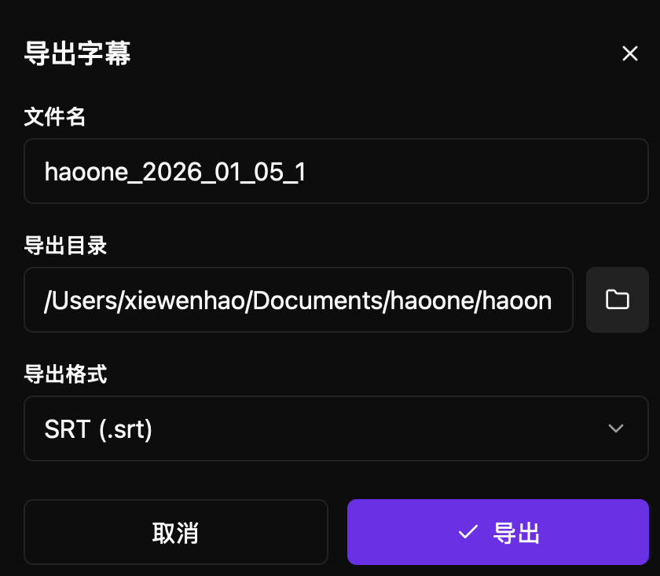
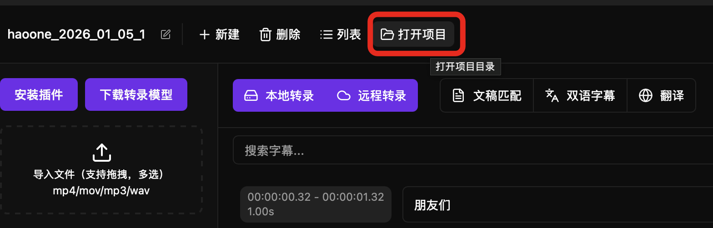
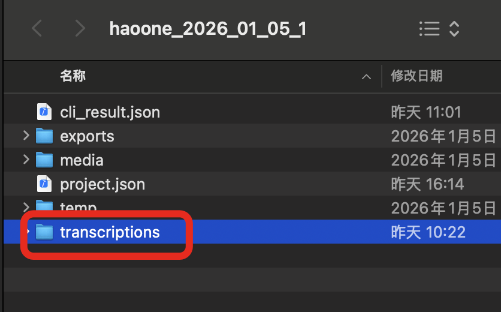

After using haoone to independently transcribe audio or video, you may want to export subtitle files.

PS: When using haoone DaVinci Resolve/PR plugins, there's no need to manually export subtitle files and then import them into DaVinci Resolve. The plugin completes automatic insertion.

There are two ways to export subtitle files:

## 1 Click Export Subtitle Button

## 2 Enter Project Directory and Copy Subtitle Files

Click "Open Project" in the software

Open the project's "transcriptions" directory:

You can find the SRT file with the corresponding filename.
