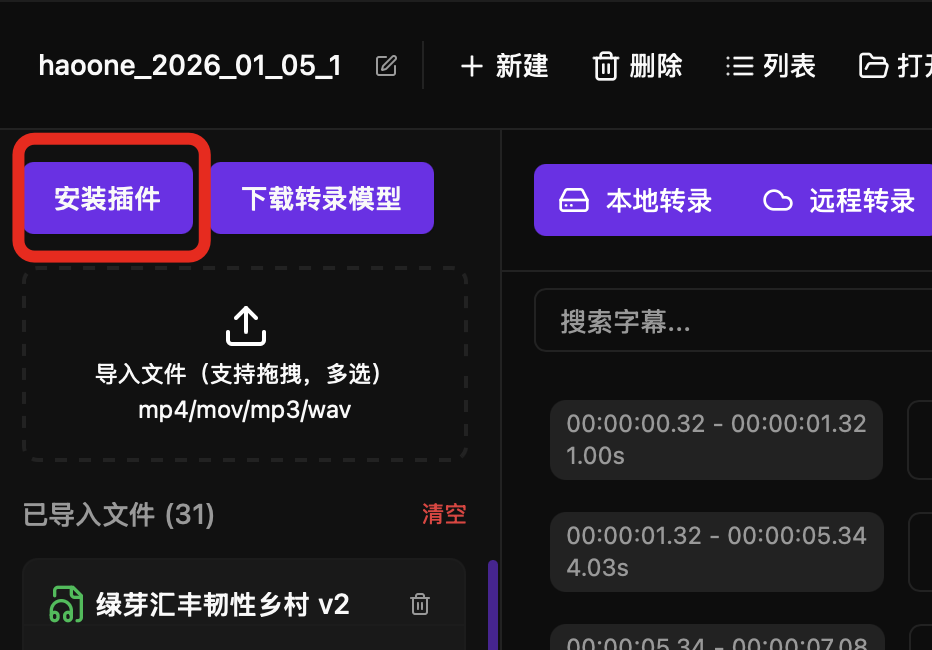
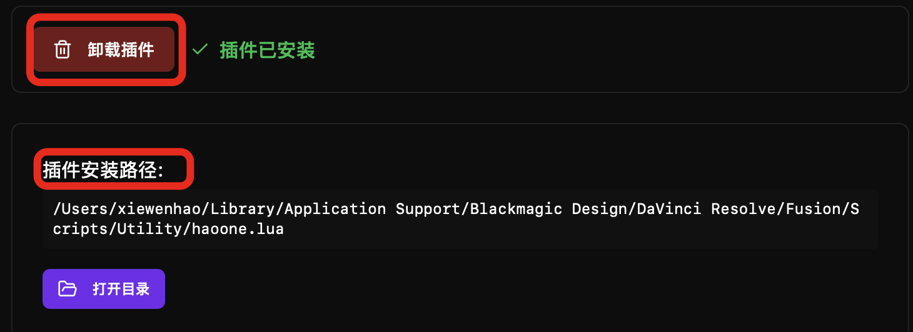
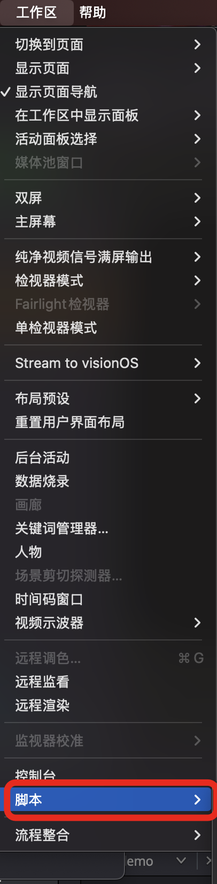
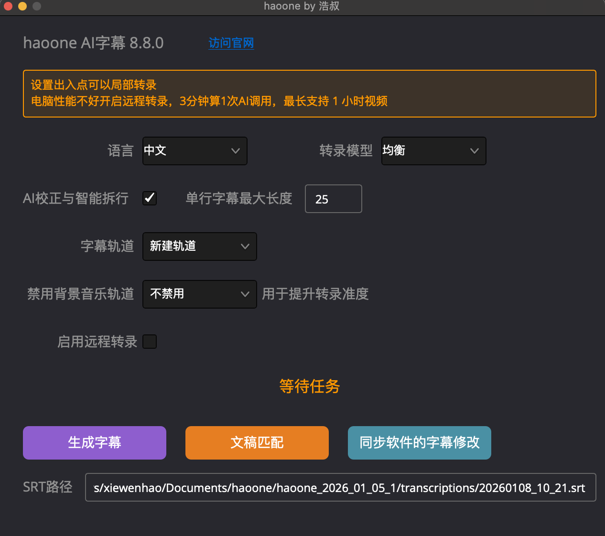

haoone provides a DaVinci Resolve integration plugin that enables you to perform one-click transcription directly within DaVinci Resolve. No need to export audio or switch applications to complete the entire transcription workflow.

## Workflow Description

```
DaVinci Resolve Timeline
         ↓
  Run haoone Plugin
         ↓
  Call haoone cli Transcription
         ↓
  Automatically Insert Subtitles into Subtitle Track
         ↓
  If Subtitles Have Errors, Edit in haoone Software
         ↓
  In Plugin, Click "Sync Subtitle Changes from Software"
```

---

## DaVinci Resolve Requirements

- **DaVinci Resolve 19.0** or higher
- **DaVinci Resolve Studio** (paid version)

## Plugin Installation

### Automatic Installation

When launching the haoone application for the first time, if DaVinci Resolve is detected as installed, the software will automatically install the haoone plugin.

When the software is updated, the next time you open the application, the haoone plugin will be automatically updated.

### Manual Installation and Plugin Removal

Click the "Install Plugin" button in the software, you will see the corresponding interface:



You can uninstall the plugin or reinstall it.



You can also open the plugin directory to verify if the plugin file exists. The filename is haoone.lua

After successful installation, in DaVinci Resolve, click "Workspace" -> "Scripts" -> "haoone" to view the plugin interface.



