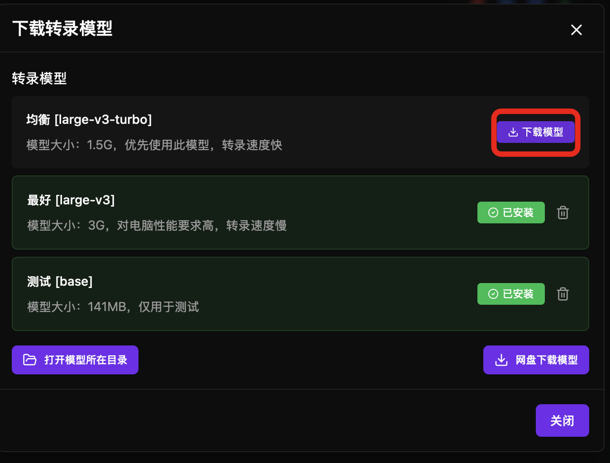
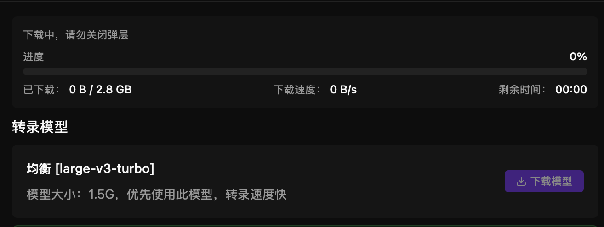
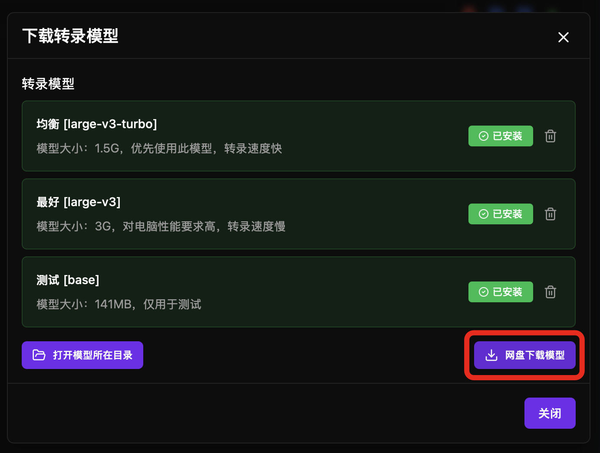
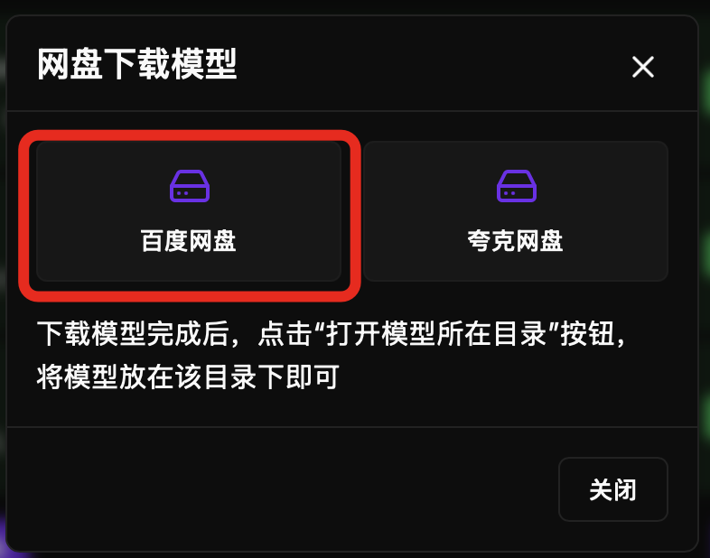
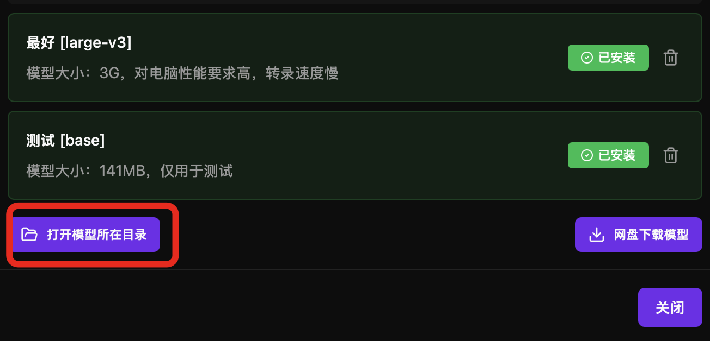

Unlike many other subtitle software, haoone does not use Whisper. Whisper's Chinese recognition accuracy is mediocre and prone to hallucinations.

In 2026, haoone's local model has been upgraded to qwen3-asr (thanks to Alibaba for open-sourcing such an excellent ASR model). The alignment algorithm is self-developed, achieving 95% accuracy in Chinese and English recognition. It can recognize songs and regional dialects, and subtitles can be aligned with audio at word-level high precision.

Both Windows and Mac have automatically enabled GPU acceleration, no complex setup required, ready to use out of the box. Windows requires the computer to have a graphics card, especially NVIDIA graphics cards.

haoone local transcription is very fast. For a 3-minute audio file, Mac M4 Max can complete transcription within 30 seconds, Windows i5 with 5060 graphics card can complete transcription in 2 minutes.

---

## Download Models

### Subtitle and Audio Alignment Model Description

You must download the subtitle and audio alignment model to use this feature. It enables word-level high-precision alignment.

### Transcription Model Description

Prioritize using the **Balanced Model** for faster transcription speed.

| Model | Size | Purpose | Recommended Disk Space |
|------|------|------|-----------|
| Chinese-English-2026 (qwen3-asr-0.6B) | ~1.5G | Chinese/English/Regional Dialect Transcription | 3 GB |

When downloading the transcription model for the first time, the subtitle and audio alignment model will be automatically downloaded.

### Select Model and Click Download Button

Do not close the popup during download.

### Use Cloud Storage Download

If model download fails or you encounter slow download speeds, you can download models from cloud storage. Currently supports Baidu Cloud and Quark Cloud.

Click "Cloud Storage Download":

Downloading models requires downloading two files:

* Windows: Download qwen3-asr-0.6B-win.zip (extract after download), Mac: Download qwen3-asr-0.6B-mac.zip
* wav2vec2.onnx

Ensure the extracted folder name is qwen3-asr-0.6B.

Click "Open Model Directory" and copy the files to the model directory.

### Open Model Storage Directory

---
