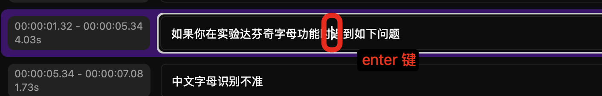
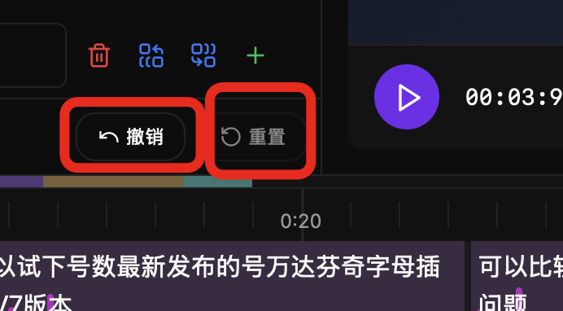
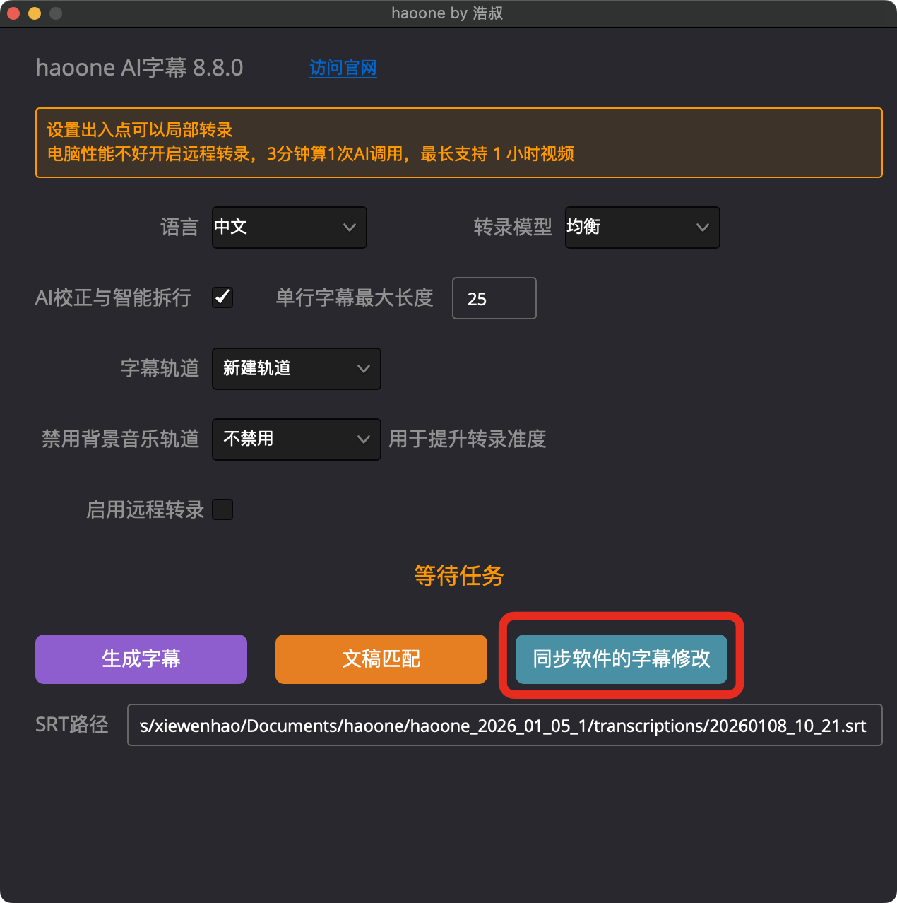

haoone software is a powerful subtitle editor that helps you quickly and efficiently edit and adjust transcribed subtitles.

The software automatically saves modifications, there is no save button.

<video src="https://cdn.haoai.pro/assets/hao-one/6.mp4" controls />

### Quick Line Splitting

At the position where you want to split, press Enter key, and it will split the line with the cursor as the boundary.

### Up/Down Arrow Keys

Up/Down arrow keys can focus the cursor to the previous or next subtitle.

###  Four Buttons After Subtitle Description

Delete, Merge to Previous Line, Merge to Next Line, Add a Line

### Search and Batch Modification

Please refer to the documentation [Subtitle Search and Batch Replace](./13 Subtitle Search and Batch Replace)

### Adjust Subtitle Start and End Time

On the timeline, you can drag to adjust the subtitle time range:

### Undo and Reset Modifications

### How to Sync Modifications to DaVinci Resolve After Editing?

Very simple, open the haoone plugin and click "Sync Subtitle Changes from Software":

### Keyboard Shortcuts

| Shortcut | Function | Platform |
|--------|------|------|
| Enter | Split current line | Windows / macOS |
| Ctrl+, / Cmd+, | Merge forward | Windows / macOS |
| Ctrl+. / Cmd+. | Merge backward | Windows / macOS |
| Ctrl+- / Cmd+- | Delete current subtitle | Windows / macOS |
| Ctrl++ / Cmd++ | Add a subtitle block | Windows / macOS |
| Ctrl+Z / Cmd+Z | Undo | Windows / macOS |
| Ctrl+Y / Cmd+Y | Redo | Windows / macOS |
| Escape | Cancel editing | Windows / macOS |
| ↑ / ↓ | Navigate between subtitle lines | Windows / macOS |

