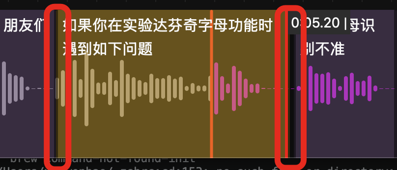
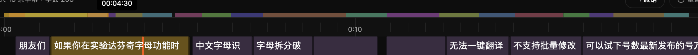

haoone 的字幕轨道是叠放在音频波形之上的，好处是方便快速调整字幕区块时间对齐音频。

### 播放/暂停

按空格即可

### 调整字幕的开始时间与结束时间

在时间线上可以拖拽调整字幕的时间范围：

### B 快捷键

使用 B 快捷键可以在播放头位置拆分当前高亮的字幕区块，拆分非常方便

### 字幕全局预览区域

在时间线之上有个多彩的线，即字幕全局预览区域，不同的字幕区块，使用不同的颜色区分，你可以点击该区块，时间线就会滚动到该字幕区块位置。

