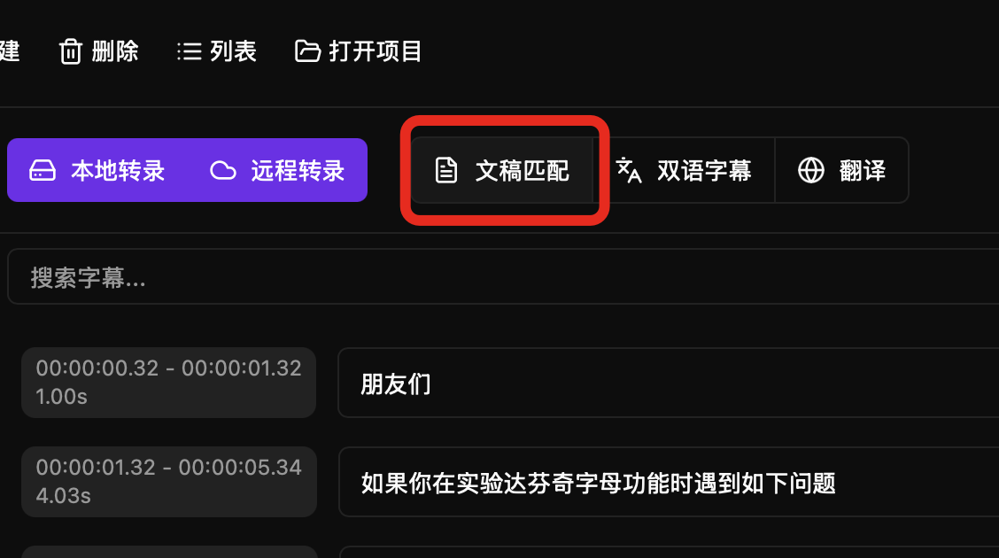
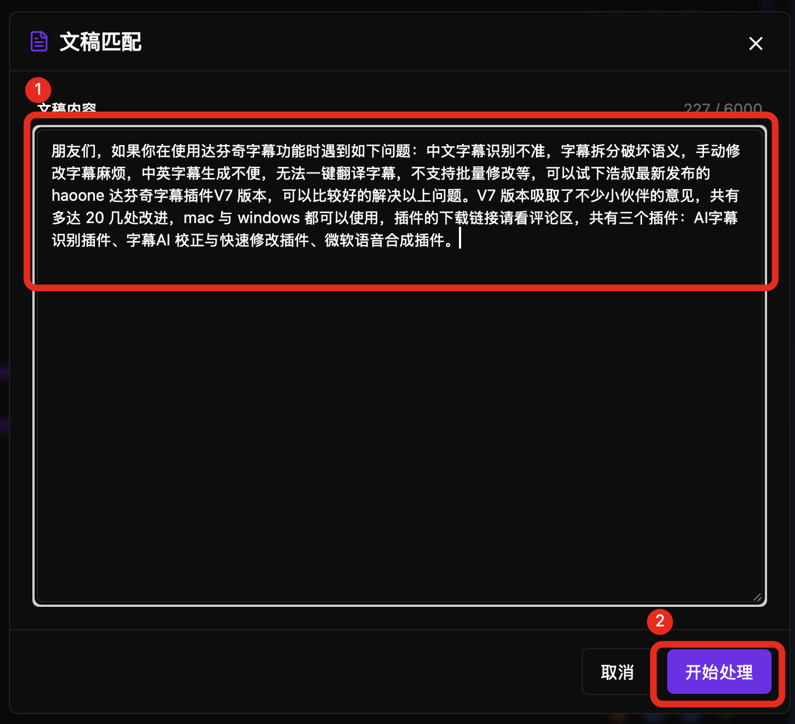
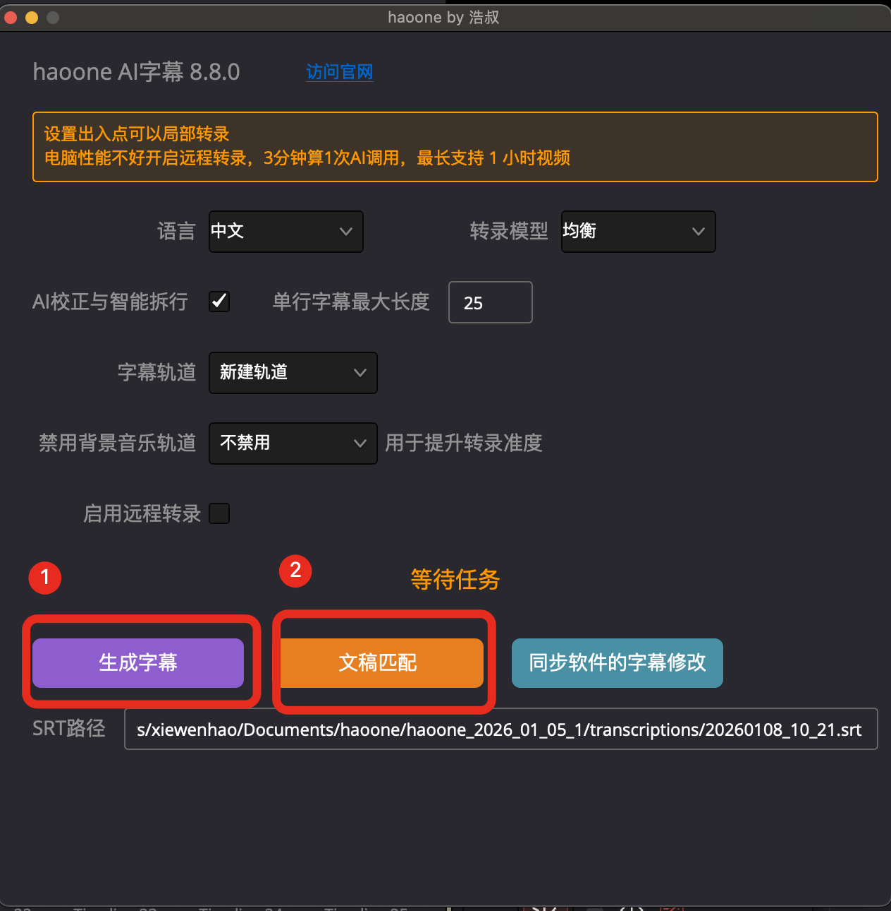
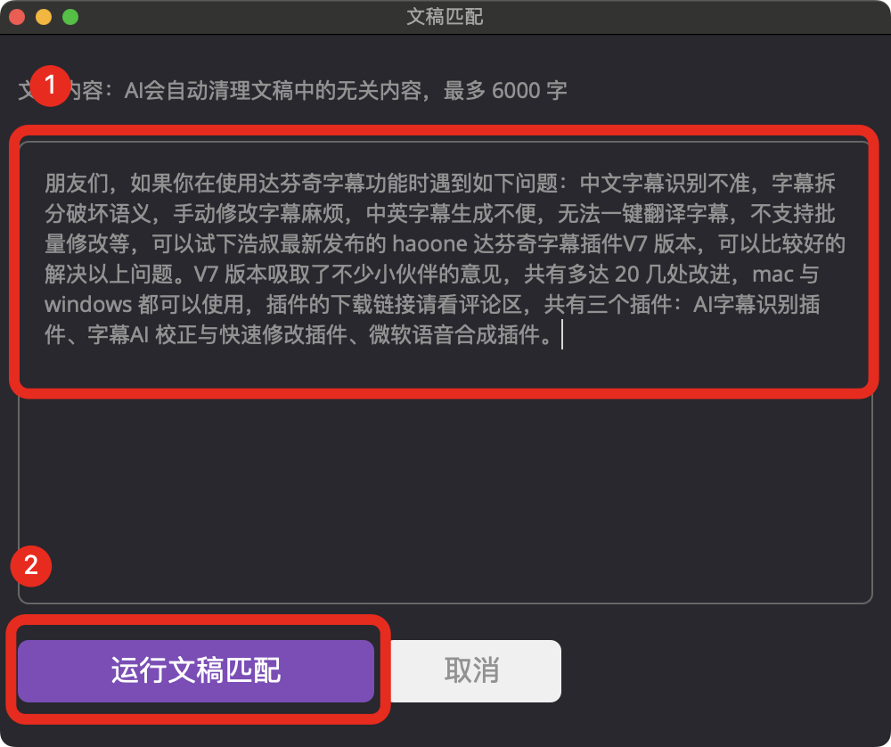

如果你已经有文字稿了，强烈推荐你使用文稿匹配功能。

软件的 AI 能力，会自动结构化文稿，拆行、清理无关内容（比如脚本说明、备注、标题等），无需你手动处理。

文稿匹配操作必须在转录操作后，不支持非 haoone 转录的字幕。

字数不限，支持拆行是否按照文稿。

## 在软件中使用文稿匹配

<video src="https://cdn.haoai.pro/assets/hao-one/4.mp4" controls />

## 工作流说明

```
  转录字幕生成成功后
         ↓
  点击文稿匹配按钮
         ↓
  复制文稿内容到输入框
         ↓
  运行
```





## 在达芬奇插件中使用文稿匹配

```
  打开时间线
         ↓
  运行 haoone 插件
         ↓
  运行转录生成字幕
         ↓
  点击文稿匹配按钮
         ↓
  复制文稿内容到输入框
         ↓
  运行
```

在达芬奇中打开 haoone 插件，先执行转录，你可以按需求选择本地转录或远程转录。

转录完成后，点击文稿匹配，输入文稿，插件是不限制字数的，另外增加了格式化文稿的功能，执行后会自动对文稿进行拆行，清理备注内容。

勾选上拆行遵循文稿后执行开始匹配，逻辑与剪映相同，算法会给转录的字幕重新按照文稿来拆行，匹配的速度是非常快的。

文稿少了句子，算法做了智能适配，是没有影响的。

如果去掉拆行遵循文稿的勾选，再执行匹配，就是开启文稿纠错字幕的模式，可以使用文稿对转录的字幕进行纠错，但不改变现有的字幕拆行。


