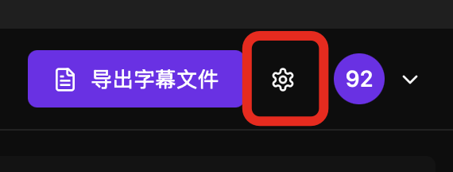
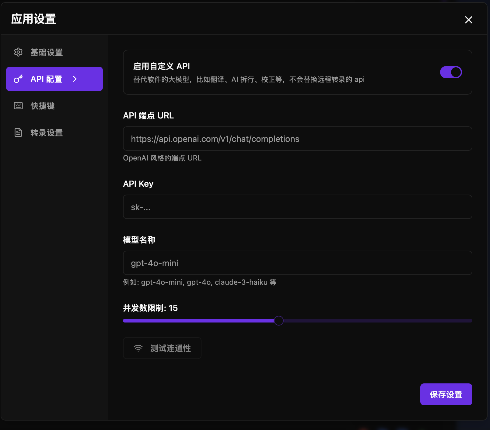

haoone 支持自定义配置大模型 API，一旦开启，除了远程转录外，所有用到大模型的地方都会使用自定义的 API。

点击设置：

点击 API 配置：

开启开关，仅支持 openai 风格的 API 。输入端点 url key 与模型即可。

填完后，务必点击下“测试连通性”，正常连通了，才可以使用。

可以自定义并发设置，默认是 5 ，并发越大，并行越快，但是注意有很多大模型提供商是限制并发数的。