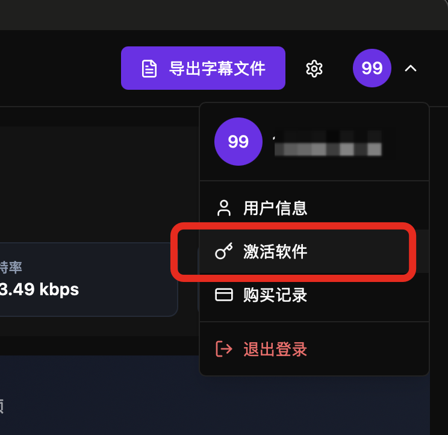
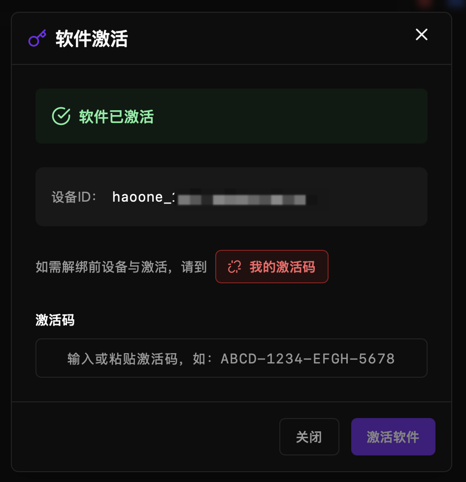
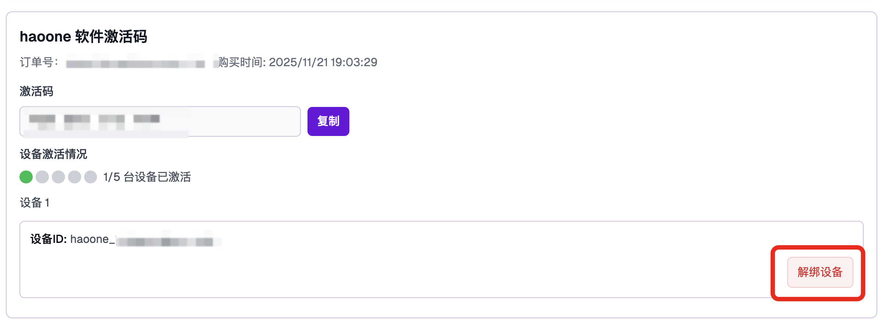

## 购买软件

到[软件购买页面](https://www.haoai.pro/haoone/pricing)购买软件，购买成功后可以到[激活码页面](https://www.haoai.pro/my/activation-codes)，看到购买的激活码了。

## 激活码说明

* 激活码支持激活 1 台电脑(Windows或Mac)，支持解绑
* 在线AI功能每个月 200 次调用额度，不限 token 长度
* 一次性买断，本地功能（包含本地 AI 功能）无限使用
* 如果需要增加 AI 调用额度，再购买激活码即可（封顶 2000 次月度调用额度）

## 激活步骤

### 第一步：打开激活对话框

1. 启动 haoone 应用，完成用户登录
2. 查看应用界面右上角
3. 找到**激活**按钮或菜单选项
4. 点击打开激活对话框

**标志**：
- 如果显示"未激活"或激活倒计时，说明需要激活
- 如果显示激活码倒计时（如"还剩 5 天"），说明试用期即将结束

### 第二步：填写激活码

在激活对话框中，您有两种方式获取激活码：

#### 方式 A：手动输入激活码

1. 找到**激活码输入框**
2. 输入或粘贴您的激活码

#### 方式 B：从已购激活码列表选择

1. 点击**选择激活码**下拉菜单
2. 查看您已购买的所有激活码列表
3. 点击要使用的激活码
4. 系统自动填充激活码字段

### 第三步：确认激活

点击确认后，就会看到激活界面：

激活时，系统自动记录：

| 信息 | 说明 |
|------|------|
| **设备 ID** | 计算机的唯一标识符 |
| **硬件指纹** | 基于硬件特征生成的标识 |
| **操作系统** | macOS、Windows 或 Linux |
| **激活日期** | 激活的具体日期和时间 |
| **设备名称** | 计算机名称 |

---

## 解绑设备

到[我的激活码](https://www.haoai.pro/my/activation-codes) 页面（需要登录）

找到激活码，你会看到解绑设备按钮，点击即可解绑。

