haoone 提供了 PR 集成插件，使您能够直接在 PR 中对视频进行一键转录。无需导出音频或切换应用，即可完成完整的转录工作流。

注意：目前 windows 执行插件时会出现 haoone 的 gui 界面（无响应），是正常现象，手动切回 pr 界面。

## 安装插件

尽量简化了插件的安装。点二次按钮即可。

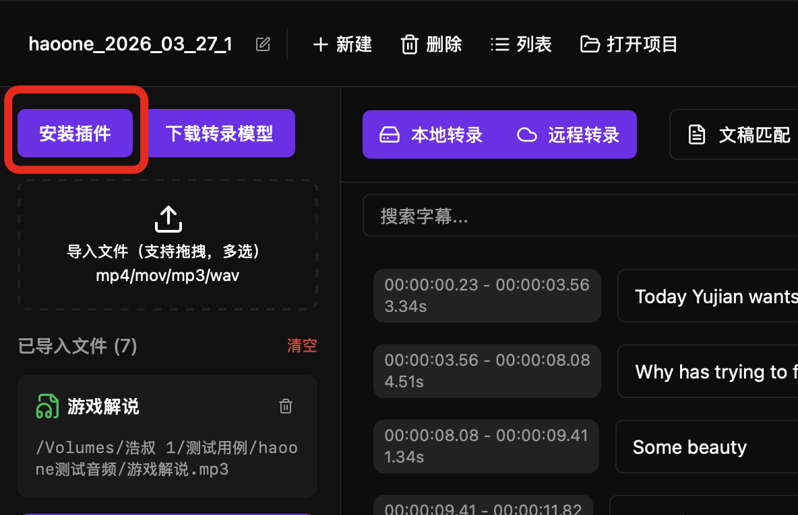
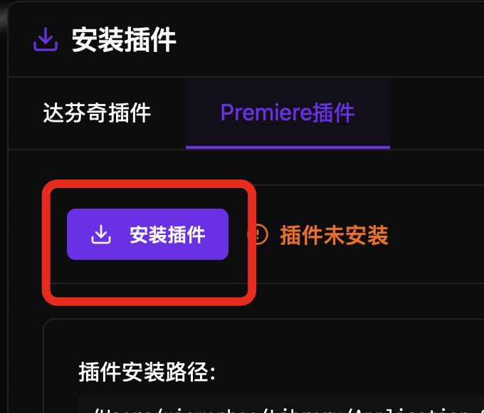

你可以 打开插件目录，确认是否有 com.haoone 目录。

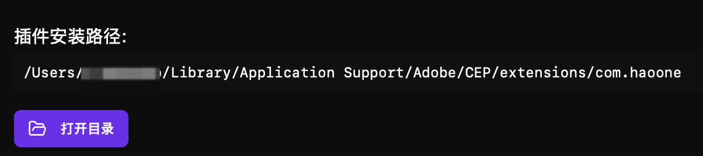

务必确保开启了 pr 的调试模式，不然在 pr 中看不到插件。

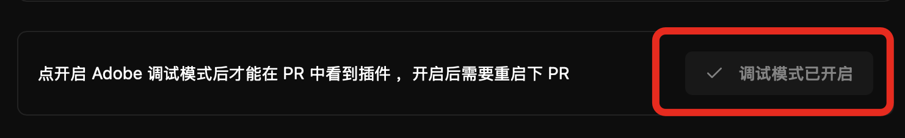

启动成功后，重启 PR 你就会看到扩展：

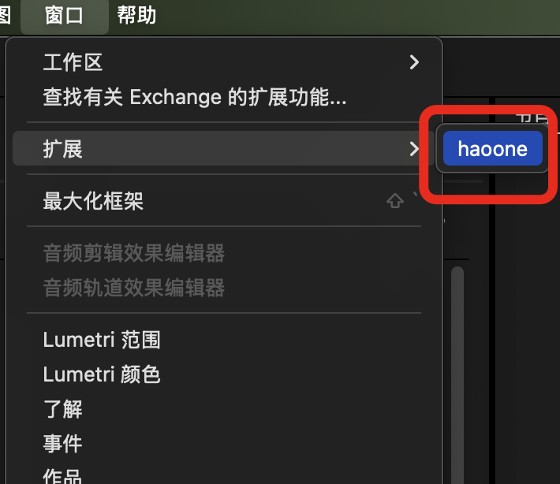

如果启动失败，请看手动开启的方法：

## 手动开启调试模式

如果你有 claude code 之类的 AI 编程工具，可以让其帮你设置。

### Mac 系统

打开终端，运行以下命令：

```bash
# 写入调试模式设置
defaults write com.adobe.PrPro "PlayerDebugMode" -bool true
```

### Windows 系统


1. 按 `Win + R` 打开运行窗口
2. 输入 `regedit` 回车打开注册表编辑器
3. 导航到：`HKEY_CURRENT_USER\Software\Adobe\Premiere Pro\Settings`
4. 在右侧空白处右键 → 新建 → DWORD 值
5. 命名为：`PlayerDebugMode`
6. 双击修改数值数据为：`1`

## 执行转录

选择远程转录或本地转录，点击生成字幕

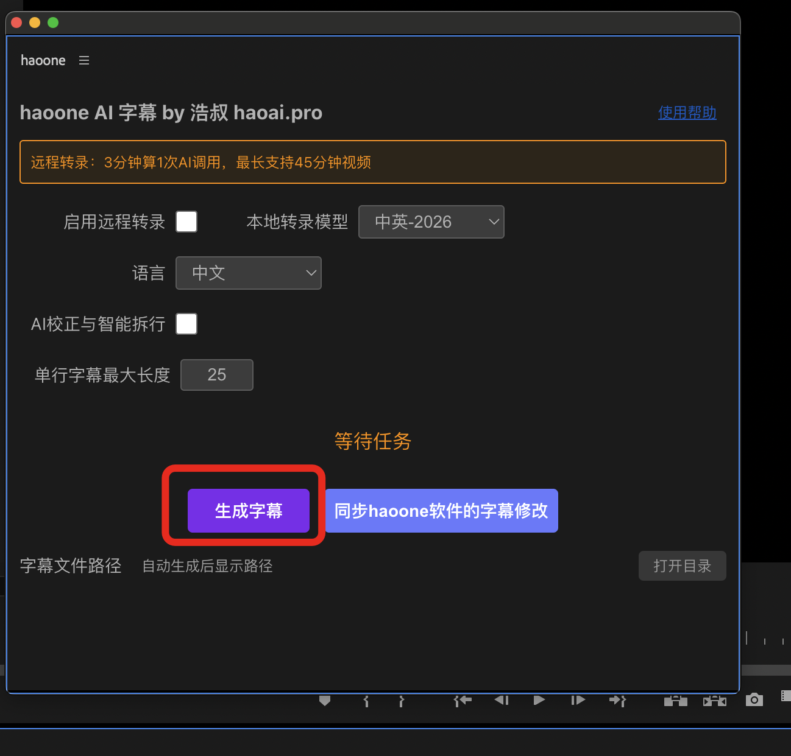

转录完成后会生成srt 文件：

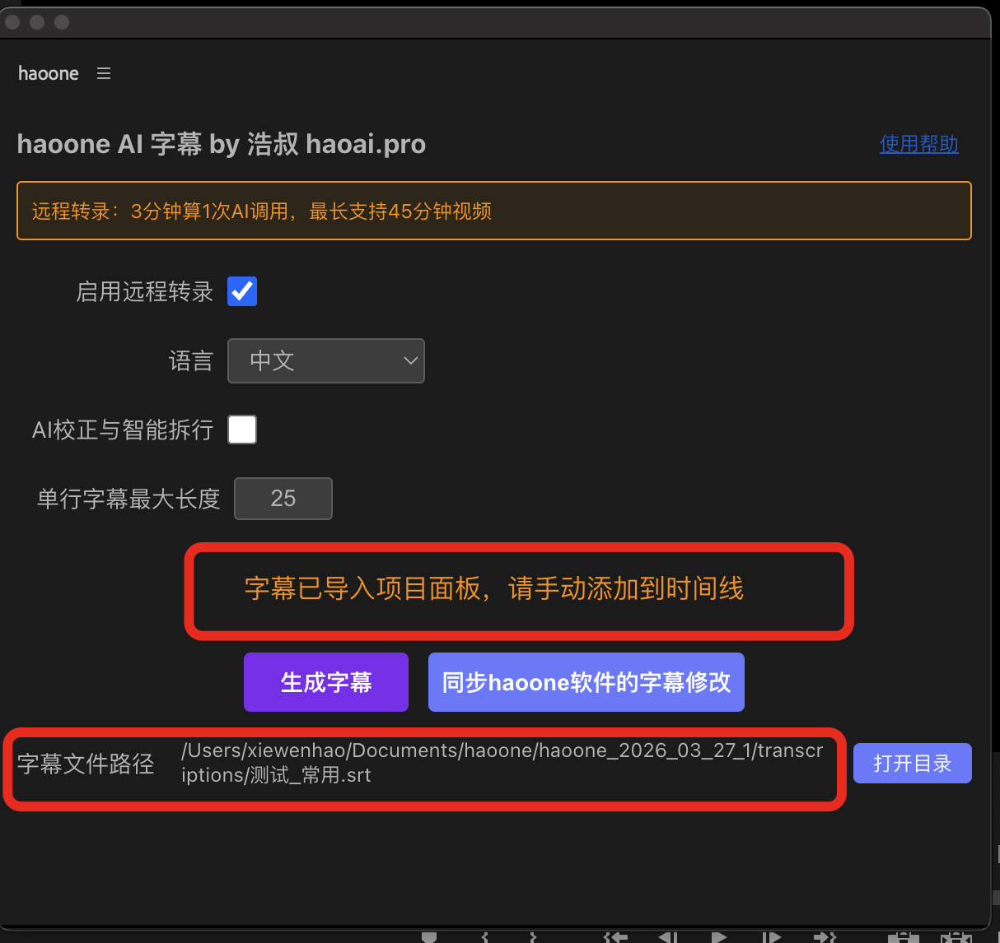

文件会自动导入到项目面板中

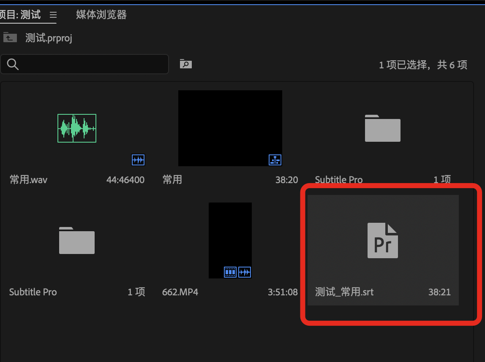

将文件拉入到序列（时间线）中：

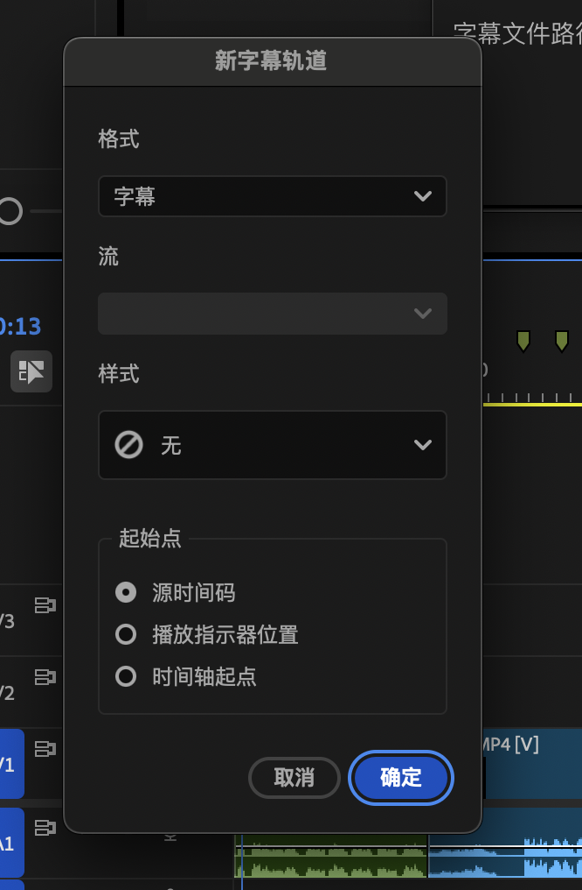

字幕插入完毕！

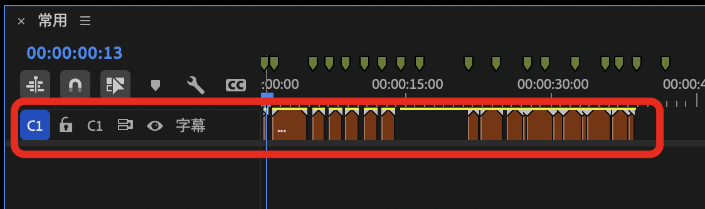

## 同步haoone软件修改

强烈建议你打开 haoone 修改字幕，可以执行文稿匹配、翻译等操作。

打开 haoone 软件，执行翻译：

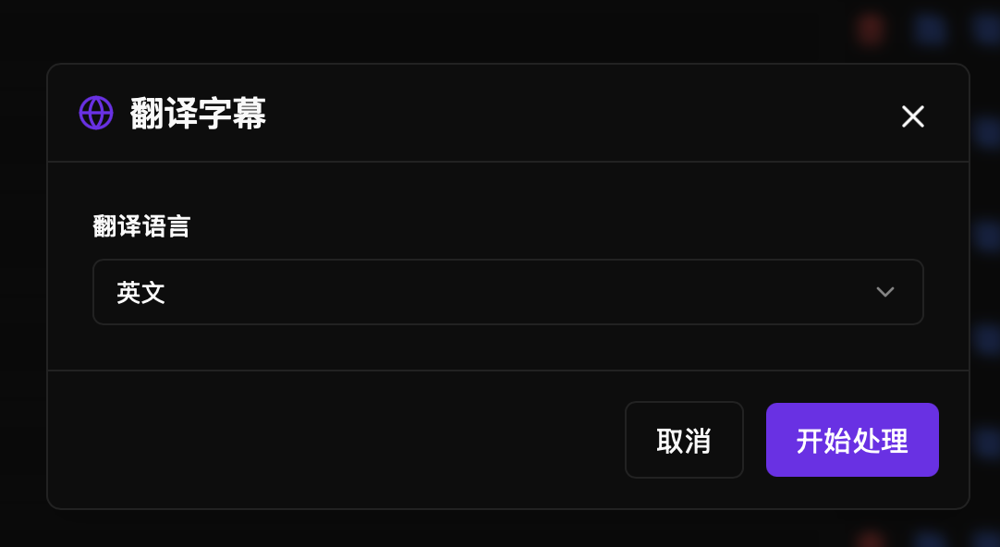

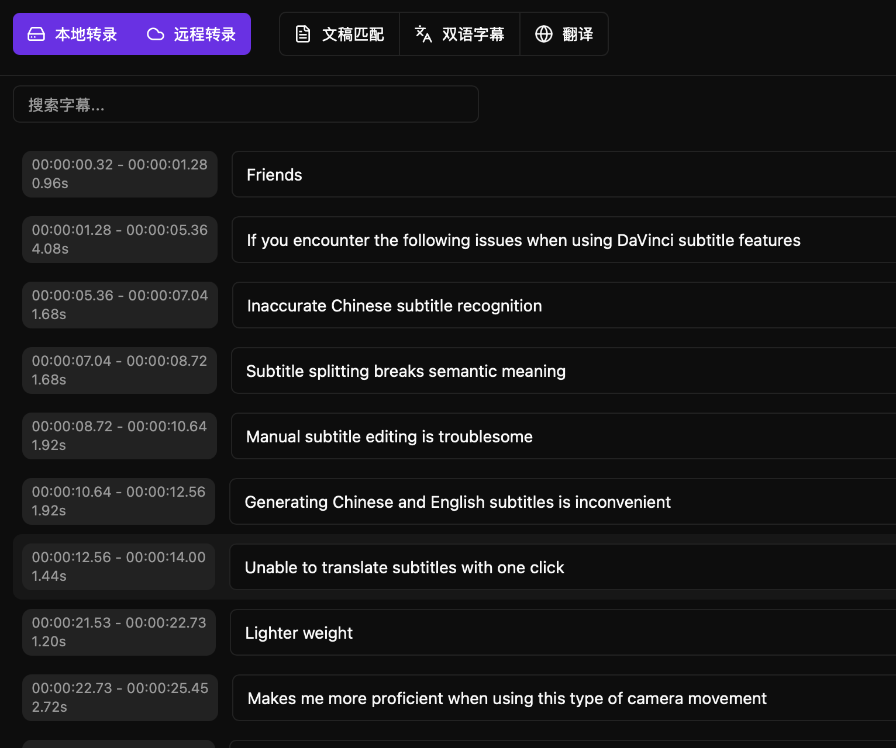

同步haoone软件修改：

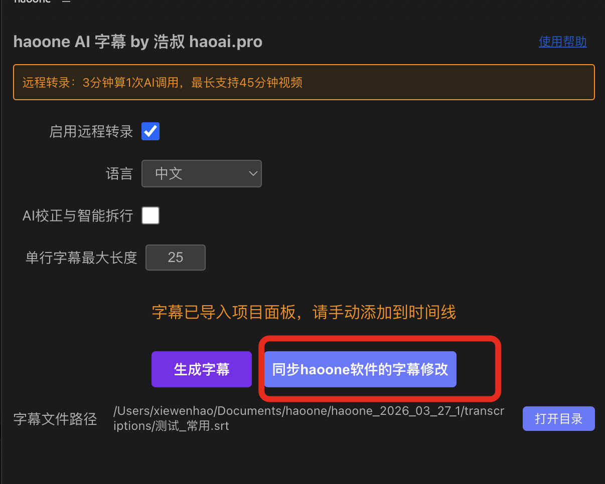

会生成新的 srt：

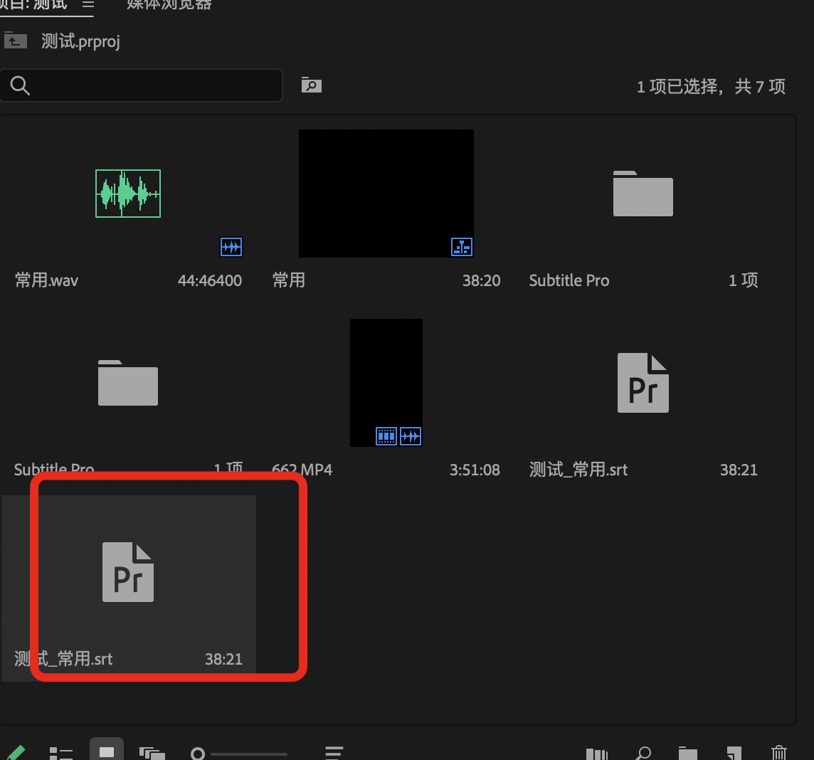

导入到序列中即可：

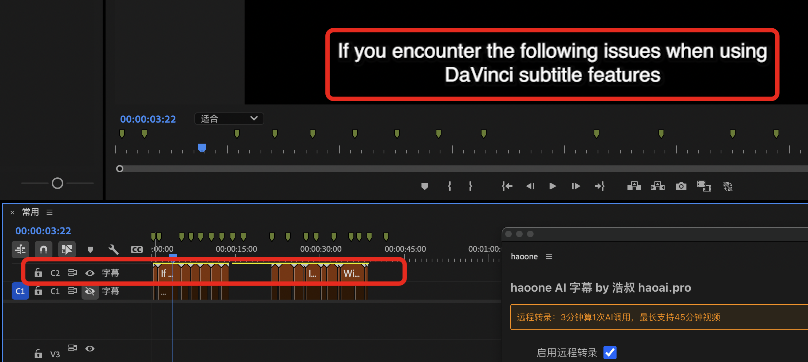