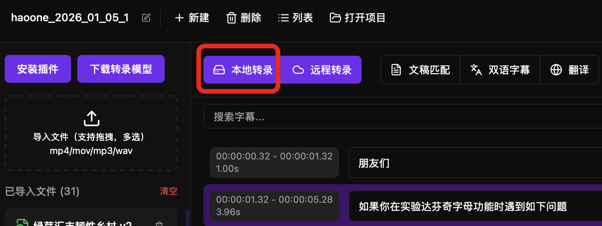
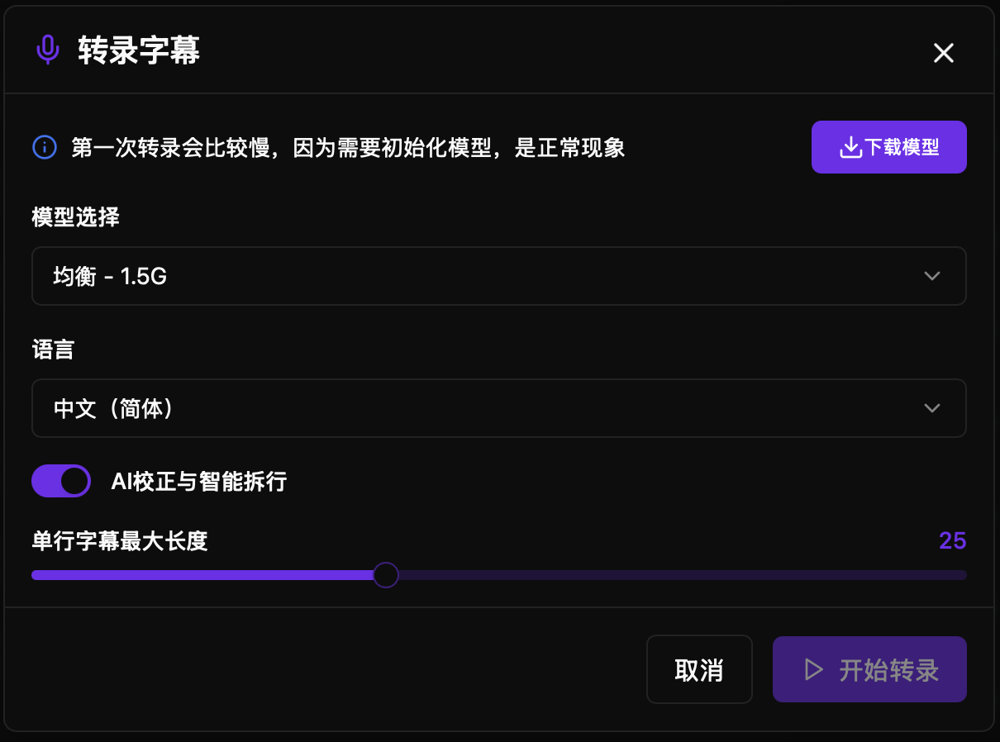
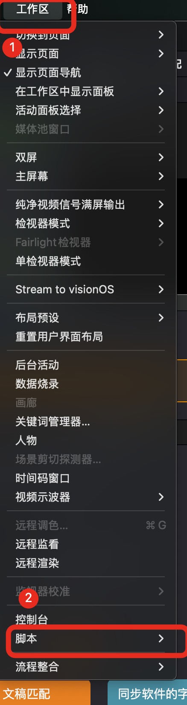
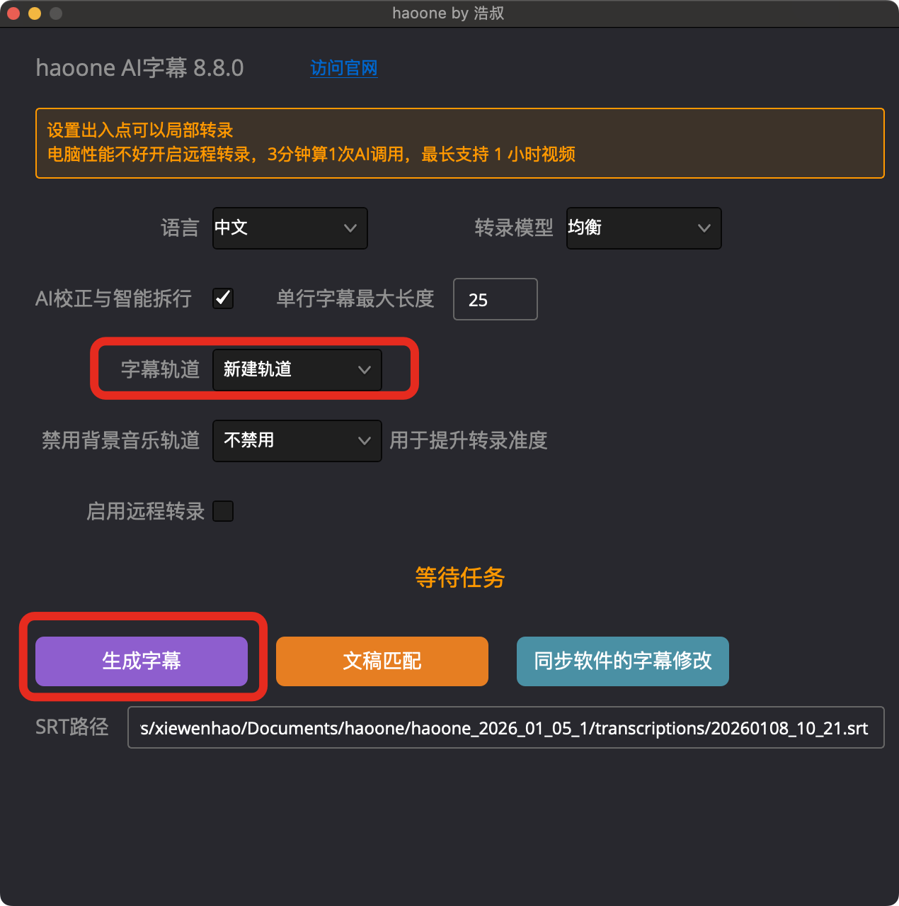

与其他很多字幕软件软件不同，haoone 并没有使用 whisper，whisper 的中文识别准确率是很一般的，还容易出现幻觉。

2026 年 haoone 的本地模型已经升级成 qwen3-asr（感谢阿里开源如此优秀的 asr 模型） ，对齐算法是自研的，可以实现中英识别准确率在 95% ，可以识别歌曲与地方方言，且字幕与音频可以实现词语级的高精度对齐。

本地转录需要你先安装好模型，请看[模型安装教程](./模型下载与管理)。

免费用户可以无限次转录 20 分钟的音视频文件。

windows 与 mac 都已经自动开启 GPU 加速，无需你复杂设置，开箱即用。windows 要求电脑需要有显卡，特别是英伟达显卡。

haoone 本地转录速度很快。3 分钟的音频，mac m4 max 30 秒内可转录完成，windows i5 5060 显卡 2 分钟可完成转录。

本地模型专门针对长音频优化，不限转录时长与使用次数。

相比于远程转录，本地模型中文与英文的识别正确率差 1%-3% 左右，很接近。

达芬奇插件支持设置时间线的出入点，实现局部转录。

<video src="https://cdn.haoai.pro/assets/hao-one/9.mp4" controls />

## 软件中使用本地转录

## 转录设置说明

### 语言选择

**支持的语言：**

暂时只支持中文与英文。

**选择语言：**

1. 在转录设置中找到**语言**选项
2. 点击下拉菜单
3. 选择音频的语言
4. 语言选择影响转录准确度

**注意：**
- 选择**错误的语言**会导致转录失败或准确度很低
- 多语言混合的音频会被识别为主要语言

#### 最大行长度

设置每行字幕的最大字符数，不建议设置 8 以下。

### 启用 AI 校正与拆行

默认启用，推荐保持开启，特别是字幕长度设置比较小的情况下，AI 会实现语义化拆行。

AI 校正 可以在设置页面自定义校正的提示词，不同的语言可以设置不同的提示词。

## 达芬奇插件中使用本地转录

<video src="https://cdn.haoai.pro/assets/hao-one/1.mov" controls />

达芬奇中，点击菜单“工作区”，点击“脚本”，选择 haoone，就会出现插件界面。

### 字幕轨道

可以指定将字幕放在哪个字幕轨道

### 禁用背景音乐

有 BGM 的最好禁用掉音乐。

### 局部转录

在时间线上使用 I O 设置出入点，可以仅转录 I O 区间的视频字幕。

