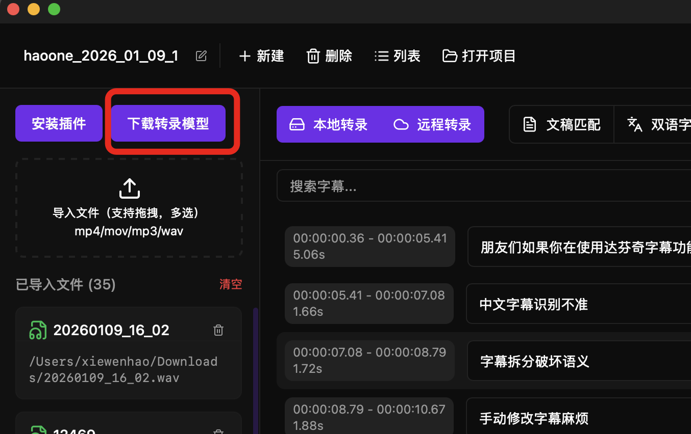
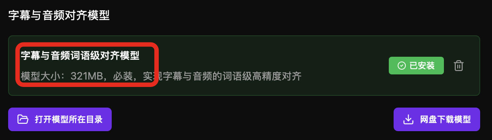
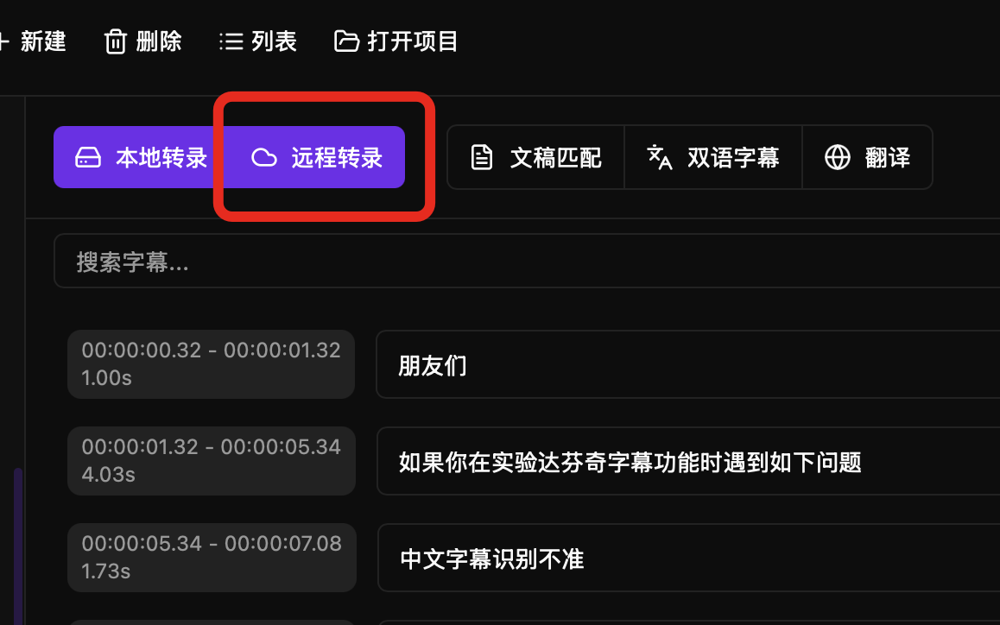
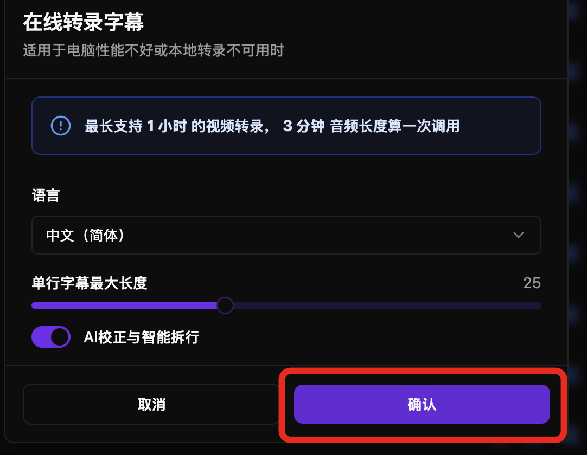
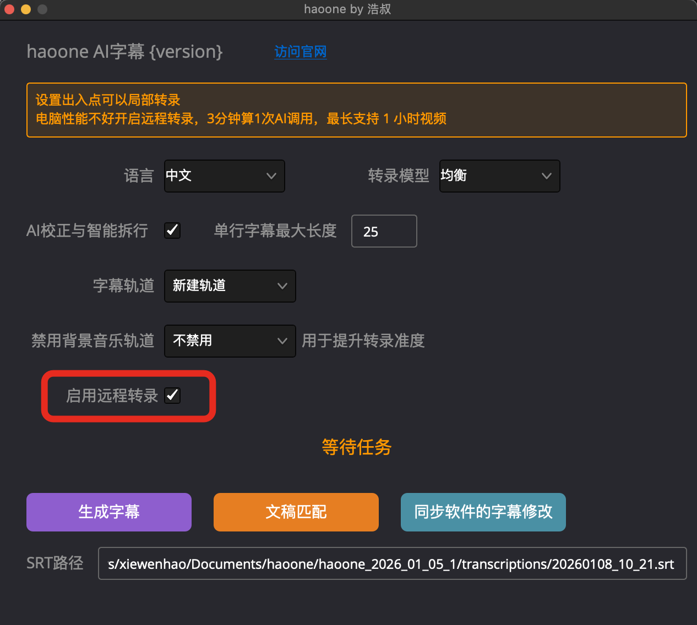
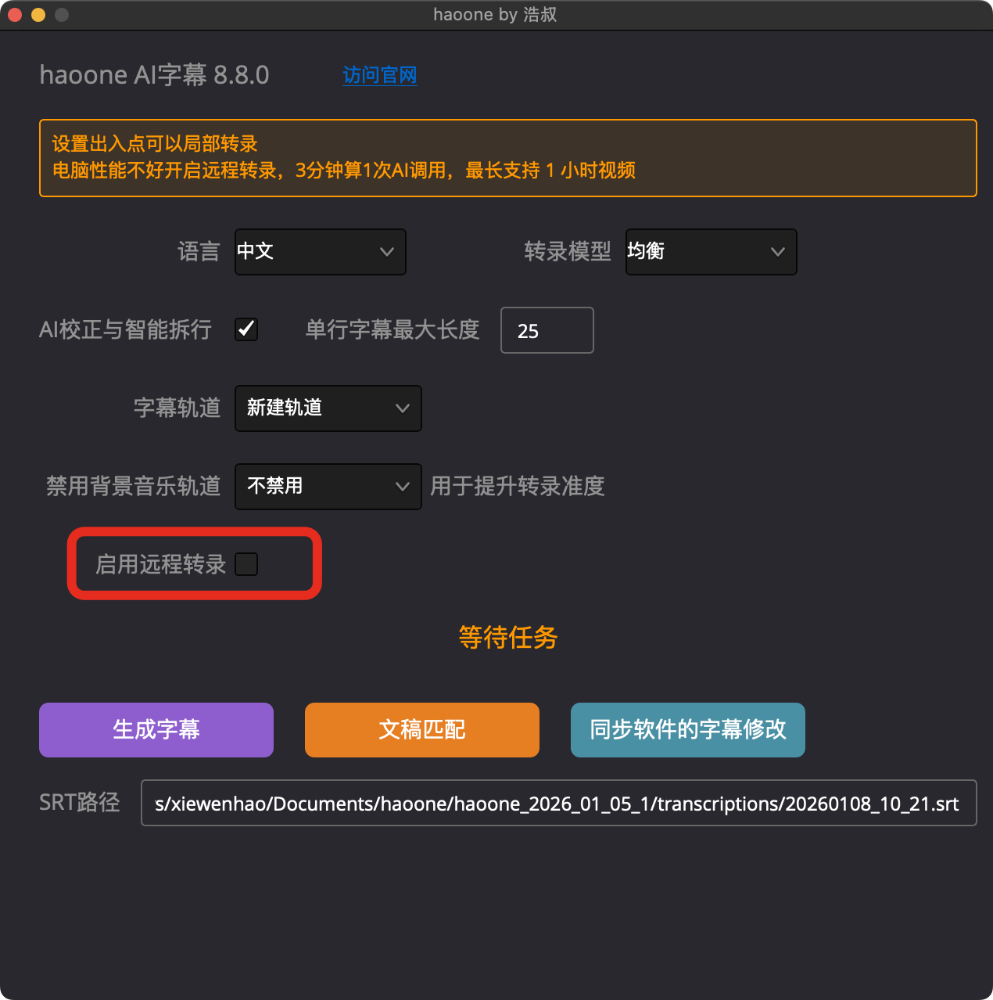

本地转录不可用，或者电脑性能差，可以使用远程转录功能。

远程转录会上传音频到服务器上（会定时删除），需要数据隐私请使用本地转录。

haoone 的远程转录速度非常快，30分钟的视频5分钟内可以完成转录，而且字幕与音频实现高精度的词语级对齐。

远程转录最长单次支持45分钟的视频转录，3 分钟算一次 AI 调用。

升级远程转录模型支持的语言范围，现在支持中文（包括 20+常见方言）、英语、日语、韩语、德语、法语、西班牙语、意大利语、葡萄牙语、俄语

达芬奇插件支持设置时间线的出入点，实现局部转录。

---

## 安装字幕与音频对齐模型

第一次使用，务必安装下字幕与音频对齐模型，不然无法使用。

haoone 针对中文场景在词语级时间戳对齐上做了很多优化。

## 软件中使用远程转录

1. **打开 haoone 导入媒体文件**
   - 点击**新建项目** 或 打开已有项目
   - 点击**导入媒体** 并选择视频/音频文件
   - 等待导入完成

2. **选择在线转录**
   - 点击**转录**按钮
   - 在对话框中选择**在线转录**（而不是本地转录）

3. **配置转录设置**
   - 选择语言
   - 字幕长度

4. **开始转录**
   - 点击**开始转录**按钮
   - 系统显示进度条

5. **等待完成**
   - 转录过程通常需要 2-10 分钟（取决于音频长度）
   - 显示详细的进度（压缩、上传、转录等）
   - 完成后你就会看到字幕

   
 

 远程转录无模型大小选择选项，默认使用最大的模型。

### 插件中使用远程转录

非常简单，勾选上远程转录即可：

 

## 转录设置说明

### 语言选择

**支持的语言：**

haoone 在线转录支持 60 多种语言.

**选择语言：**

1. 在转录设置中找到**语言**选项
2. 点击下拉菜单
3. 选择音频的语言
4. 语言选择影响转录准确度

**注意：**
- 选择**错误的语言**会导致转录失败或准确度很低
- 多语言混合的音频会被识别为主要语言

#### 最大行长度

设置每行字幕的最大字符数，不建议设置 8 以下。

### 启用 AI 校正与拆行

默认启用，推荐保持开启，特别是字幕长度设置比较小的情况下，AI 会实现语义化拆行。

## 达芬奇插件中使用远程转录

勾选上启用远程转录即可：

软件会记忆你的勾选。

### 局部转录

在时间线上使用 I O 设置出入点，可以仅转录 I O 区间的视频字幕。