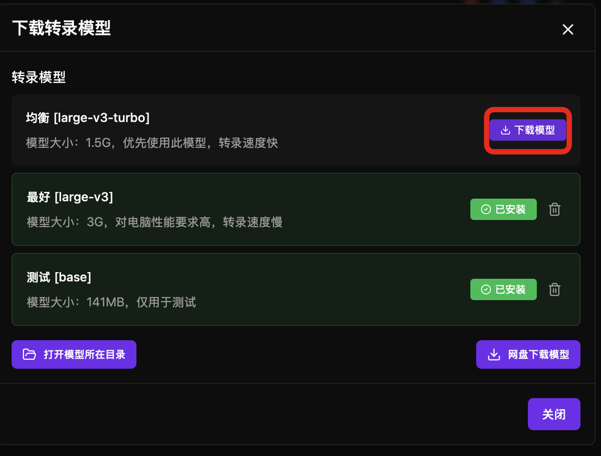
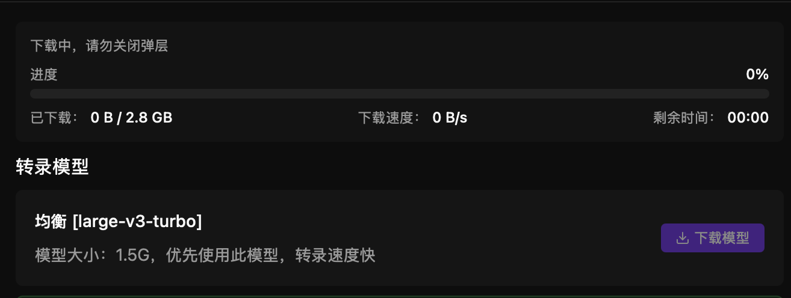
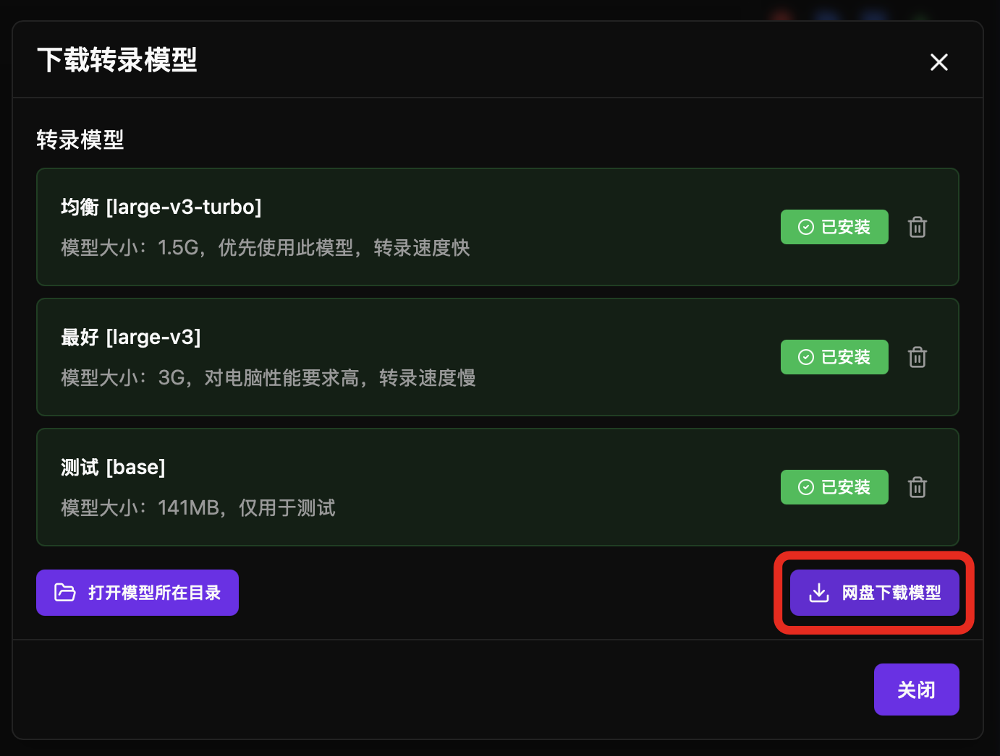
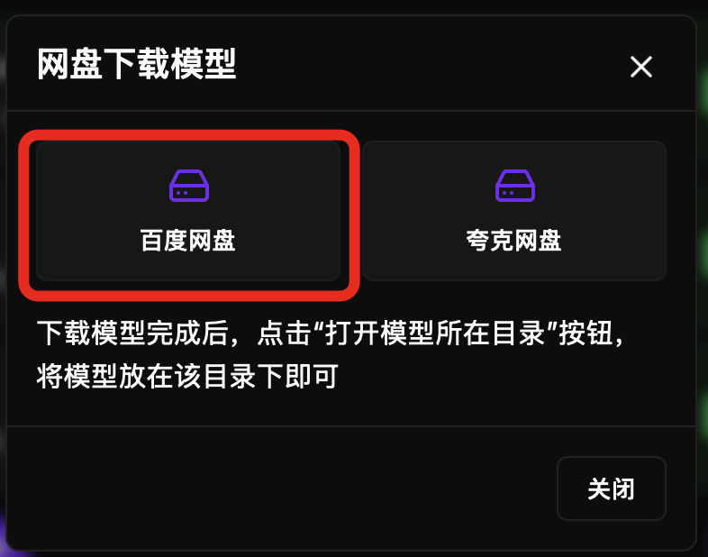
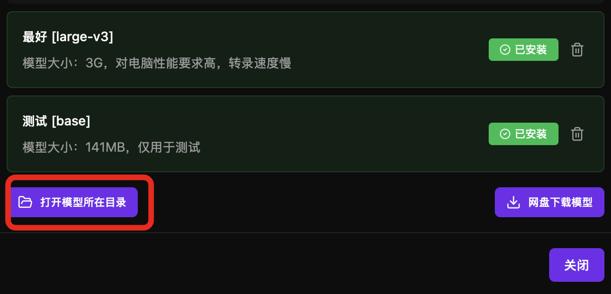

与其他很多字幕软件软件不同，haoone 并没有使用 whisper，whisper 的中文识别准确率是很一般的，还容易出现幻觉。

2026 年 haoone 的本地模型已经升级成 qwen3-asr（感谢阿里开源如此优秀的 asr 模型） ，对齐算法是自研的，可以实现中英识别准确率在 95% ，可以识别歌曲与地方方言，且字幕与音频可以实现词语级的高精度对齐。

windows 与 mac 都已经自动开启 GPU 加速，无需你复杂设置，开箱即用。windows 要求电脑需要有显卡，特别是英伟达显卡。

haoone 本地转录速度很快。3 分钟的音频，mac m4 max 30 秒内可转录完成，windows i5 5060 显卡 2 分钟可完成转录。

---

### 自定义模型位置

模型比较大，建议设置模型位置，避免模型放在 C 盘

## 下载模型

### 字幕与音频对齐模型说明

必须下载对齐模型-V2 ，不然无法使用转录功能。

### 转录模型说明

| 模型 | 大小 | 用途 | 
|------|------|------|
| 中英-v2-2026（qwen3-asr-0.6B） | 1.5G | 中文/英文/地方方言转录 | 
| 多语种-增强-2026（qwen3-asr-1.7B） | 2.5G | 中文识别准确率超过剪映 | 
| 英语专用模型（cohere-transcribe） | 2.4G | 英文识别准确率 97%(2026最佳)，执行速度是多语种-增强-2026 2 倍 | 
| 日语专用模型（parakeet-tdt-0.6b-ja） | 2.4G | 日语识别准确率94%，执行速度极快 | 

第一次下载转录模型下载，会自动下载字幕与音频对齐模型。

### 选择模型点击下载按钮即可

下载中，请勿关闭弹层。

### 使用网盘下载

如果你下载模型失败，或遇到下载很慢的问题，可以到网盘下载模型，目前支持百度网盘与夸克网盘

点击“网盘下载”：

### 打开模型存储目录

---